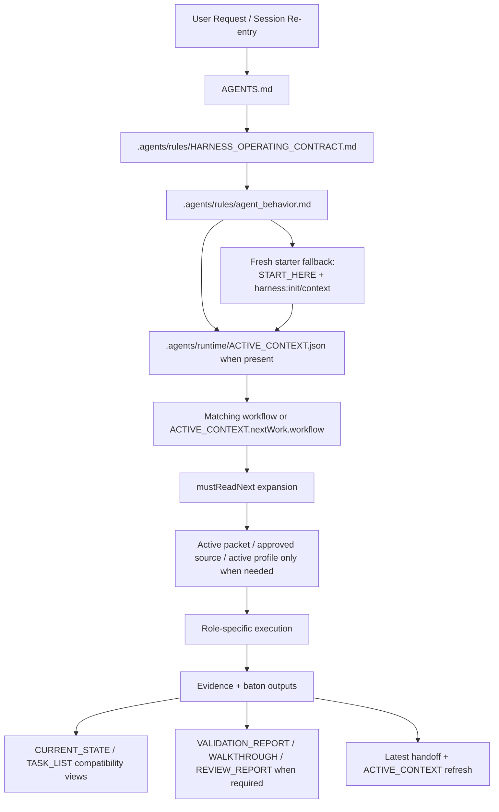

# Harness File Route Audit Matrix

## Purpose

이 문서는 하네스 문서를 증상별로 고치는 대신, 먼저 `어떤 진입점이 어떤 파일을 어떤 순서로 읽고 어떤 파일을 갱신하는가`를 체계적으로 점검하기 위한 reusable audit 기준표다.

이 문서는 authority를 대체하지 않는다.
실제 authority는 `AGENTS.md` Codex entry contract, `.agents/rules/HARNESS_OPERATING_CONTRACT.md`, `.agents/rules/agent_behavior.md`, `.agents/workflows/*`, generated `.agents/runtime/ACTIVE_CONTEXT.*` when present, active packet, approved source artifact에 있다.
fresh copied starter에서 generated `ACTIVE_CONTEXT.*` / `VALIDATION_REPORT.*`가 아직 없으면 `START_HERE.md`, `AGENTS.md`, `harness:init`, `harness:context`가 bootstrap fallback이다.

## Route Overview

## Whole Project Flow Audit

이 표는 최초 프로젝트 시작부터 매 작업, 배포까지 이어지는 사람이 읽는 route 점검표다. 실제 authority는 각 workflow/packet/source artifact에 있고, 이 문서는 어떤 파일을 먼저 확인해야 하는지 감사하는 guide다.
Risk class, route class, gate profile, workflow role, evidence set 조합을 고르는 실무 기준은 `reference/manuals/human/HARNESS_MANUAL.md`의 `Option combination matrix`를 primary guide로 본다.

| Flow step | Human question | Primary route | Read first | Output | Do not |
|---|---|---|---|---|---|
| First project start | 새 프로젝트인가, 기존 프로젝트 흡수인가? | starter kickoff / migration | `README.md`, `START_HERE.md`, `reference/manuals/human/HARNESS_MANUAL.md`; before init, missing `ACTIVE_CONTEXT.*` / `VALIDATION_REPORT.*` is expected | initialized harness state or migration preview/apply path | 구현 packet 없이 첫 기능 구현 시작 |
| Kickoff baseline | 목적, 사용자, 업무흐름, 데이터, 권한, 운영 기준이 충분한가? | Planner / kickoff planning | `PROJECT_STARTER_DOC_PACK.md`, `PLN-00`, `REQUIREMENTS.md`, `PLN-01` | requirements freeze decision | blank blocker를 두고 architecture/implementation sync |
| Fresh kickoff deep interview | product goal, users, workflow, data, approval boundary, profile decision이 닫혔는가? | Planner / deep interview | `START_HERE.md`, `reference/artifacts/PROJECT_STARTER_DOC_PACK.md`, `reference/planning/PLN-00_DEEP_INTERVIEW.md`; then `.agents/artifacts/REQUIREMENTS.md`, `reference/planning/PLN-01_REQUIREMENTS_FREEZE.md` | kickoff baseline, approved/open/deferred requirements, freeze blockers | product goal, users, workflow, data, approval boundary, or profile decision이 불명확한데 first packet 작성 |
| Requirements authoring / rebase | 요구사항 기준선을 작성하거나 구조적으로 다시 닫는가? | Planner / requirements authoring | `.agents/runtime/ACTIVE_CONTEXT.json` when present, `.agents/workflows/planner.md`, `.agents/artifacts/REQUIREMENTS.md` | updated requirements baseline or rebase proposal | architecture, API, data ownership, deployment, approval boundary 영향이 Planner 승인 없이 섞임 |
| Fresh-start drill | 첫 packet 흐름을 끝까지 리허설하는가? | generic drill / approved packet route | `reference/manuals/human/HARNESS_MANUAL.md` section 3.3A, active packet, packet template, active profile docs when needed | full drill evidence, not generic project authority | copied-starter context를 maintainer installer context로 착각 |
| Ordinary work packet | 이번 작업의 scope, acceptance, risk/route/gate가 닫혔는가? | Planner / packet opening | `ACTIVE_CONTEXT`, active packet, `REQUIREMENTS.md` | packet summary, decision alternatives/recommendation, Ready For Code approve or hold | Ready For Code 없이 Developer 진입 |
| Orchestrated delivery | 구현, 검증, 리뷰가 역할별 evidence로 닫혔는가? | Orchestrator -> Developer -> Tester -> Reviewer -> Planner | active packet, role workflow, validation report, walkthrough/review evidence | closeout, bounded remediation, or split | Orchestrator가 직접 구현/검증/리뷰 판단 대체 |
| Deployment or cutover | 실제 배포 대상, 실행자, rollback boundary가 닫혔는가? | Deployer / release-cutover packet | `DEPLOYMENT_PLAN.md`, deploy workflow, active release/cutover packet | deploy, rollback, or hold decision | harness validation pass를 release approval로 취급 |
| Day wrap / re-entry | 다음 세션 첫 행동이 명확한가? | PM / Handoff / active workflow | `ACTIVE_CONTEXT`, latest handoff, active packet | next owner, next workflow, next first action | generated state를 직접 고쳐 baton 대체 |

## Authority Classes

| Class | Typical files | Default read rule | Update rule | Audit focus |
|---|---|---|---|---|
| Constitutional entry | `AGENTS.md`, `.agents/rules/HARNESS_OPERATING_CONTRACT.md`, `.agents/rules/agent_behavior.md` | always at route entry | edit only when reusable route/behavior contract changes | Codex entry contract, load order, authority wording, stop conditions |
| Live re-entry route | `.agents/runtime/ACTIVE_CONTEXT.json`, `.agents/runtime/ACTIVE_CONTEXT.md`, `.harness/operating_state.sqlite` | `ACTIVE_CONTEXT.json` first, DB-backed state under the hood | never hand-edit generated `ACTIVE_CONTEXT.*`; regenerate through runtime/CLI | route coherence, freshness, owner/next action parity |
| Workflow contracts | `.agents/workflows/*.md` | read the matching workflow after `ACTIVE_CONTEXT` | edit when role contract, read order, or evidence rules change | role authority, required inputs, outputs, handoff gates |
| Canonical project SSOT | `.agents/artifacts/REQUIREMENTS.md`, `ARCHITECTURE_GUIDE.md`, `IMPLEMENTATION_PLAN.md`, `ACTIVE_PROFILES.md`, `PROJECT_PROGRESS.md` | read only when the active route/task needs them | edit directly as governance truth; preserve starter-health / memory-boundary guidance while customizing product sections | accuracy of approved scope, acceptance, sequencing, starter-health boundary preservation |
| Compatibility views | `.agents/artifacts/CURRENT_STATE.md`, `.agents/artifacts/TASK_LIST.md` | read only when `mustReadNext`, packet evidence, or troubleshooting requires them | do not treat as primary route authority; keep regenerated/parity-aligned | stale wording, overuse as default input, baton readability |
| Active packet / approved source | `reference/packets/*.md`, approved source artifacts | read only when the current task depends on them | edit as task-specific authority | packet-before-code, approval boundary, required evidence |
| Reference templates/manuals | `reference/artifacts/*`, `reference/manuals/*`, `reference/profiles/*` | optional unless the active task explicitly requires them | edit when reusable guidance/template changes | optional vs mandatory drift, discoverability |
| Optional evidence artifacts | `reference/artifacts/WALKTHROUGH.md`, `REVIEW_REPORT.md`, `HANDOFF_ARCHIVE.md`, `reference/artifacts/daily/*` | create/read only when the route actually needs them | first-use creation is valid; not starter-mandatory | accidental mandatory wording, first-use guidance, no shipped day-wrap template assumption |

## Route Matrix

| Route | Read first | Expand only when needed | Typical outputs / updates | Stop if |
|---|---|---|---|---|
| New conversation / AI re-entry | `AGENTS.md` -> `HARNESS_OPERATING_CONTRACT.md` -> `agent_behavior.md` -> `ACTIVE_CONTEXT.json` when present; fresh starter fallback is `START_HERE.md` + `harness:init` / `harness:context` -> matching workflow | `mustReadNext`, active packet, approved source, active profile | none by default; route restoration only | workflow route is unclear |
| Project Manager / `day_start` | `ACTIVE_CONTEXT.json`, matching workflow or `project_manager.md` | compatibility views, active packet, preventive memory, optional daily note | start brief, next workflow, first action, evidence-gap summary | next owner/first action is ambiguous |
| Project Manager / `day_wrap_up` | `ACTIVE_CONTEXT.json`, workflow that owned today's work or `project_manager.md` when route is unclear | compatibility views, packet, validation/review evidence, preventive memory, optional daily note | completed/still-open summary, verification status, next workflow, next-session first action | day-end state still depends on guessed status |
| Planner / packet opening | `ACTIVE_CONTEXT.json`, `REQUIREMENTS.md`, matching planning workflow | `CURRENT_STATE`/`TASK_LIST` when route contract requires, starter doc pack, verification template, active source, active packet draft | requirements/planning baseline updates, packet draft, plain-language packet summary, decision alternatives/recommendation, approval ask | scope or approval boundary is unclear |
| Fresh kickoff deep interview | `START_HERE.md`, `reference/artifacts/PROJECT_STARTER_DOC_PACK.md`, `reference/planning/PLN-00_DEEP_INTERVIEW.md` | `.agents/artifacts/REQUIREMENTS.md`, `reference/planning/PLN-01_REQUIREMENTS_FREEZE.md`, active profile docs if selected | kickoff baseline, approved/open/deferred requirements, freeze blockers | product goal, users, workflow, data, approval boundary, or profile decision is unclear |
| Requirements authoring / rebase | `ACTIVE_CONTEXT.json` when present, `.agents/workflows/planner.md`, `.agents/artifacts/REQUIREMENTS.md` | `reference/manuals/REQUIREMENTS_AUTHORING_GUIDE.md`, `.agents/skills/requirements_deep_interview/SKILL.md` | updated requirements baseline or rebase proposal | architecture, API, data ownership, deployment, or approval boundary changes without Planner approval |
| Fresh-start drill | `reference/manuals/human/HARNESS_MANUAL.md` section 3.3A, active packet | packet template, active profile docs, `START_HERE.md` for kickoff reminder | full drill evidence, not generic project authority | copied-starter context is mistaken for maintainer installer context |
| Analyst | `.agents/workflows/analyst.md`, source intake or option-space material | Planner workflow only after the analyst brief is complete | option framing, evidence inventory, contradiction analysis, pre-planning investigation brief | implementation, packet approval, Ready For Code, or state mutation is requested |
| Orchestrator | `.agents/runtime/ACTIVE_CONTEXT.json`, active packet, `.agents/workflows/orchestrator.md` | Developer, Tester, Reviewer, Planner workflows and original evidence paths | route handoff, fix-loop state, closeout package for Planner | asked to implement, test, review, approve residual risk, or close packet directly |
| Designer / UI lane | `ACTIVE_CONTEXT.json`, `REQUIREMENTS.md`, `ARCHITECTURE_GUIDE.md`, `UI_DESIGN.md` | active packet, UX archetype, source artifacts | design decisions, mockup/state expectations | no real UI scope or approval missing |
| Developer / packet implementation | `ACTIVE_CONTEXT.json`, active packet, `REQUIREMENTS.md`, `ARCHITECTURE_GUIDE.md` | targeted `IMPLEMENTATION_PLAN.md` section for sequencing/root-starter sync, verification template, cloud/local merge playbook, compatibility views when needed | code/runtime changes, required doc updates, `harness:validate`, `harness:validation-report` | packet approval or environment assumptions are missing |
| Tester / packet verification | `ACTIVE_CONTEXT.json`, active packet, `REQUIREMENTS.md`, `ARCHITECTURE_GUIDE.md` | `IMPLEMENTATION_PLAN.md` only when packet acceptance or reusable sync evidence cites it, walkthrough, verification scenario template, compatibility views when needed | tested/untested evidence, defects, optional `WALKTHROUGH.md` update | environment missing or implementation change is required |
| Reviewer / packet closeout review | `ACTIVE_CONTEXT.json`, active packet, `PACKET_EXIT_QUALITY_GATE`, `REQUIREMENTS.md`, `ARCHITECTURE_GUIDE.md` | `IMPLEMENTATION_PLAN.md` only when closeout depends on current sequencing or reusable sync expectations, verification scenario template, review report, cloud/local merge playbook | findings or approval, optional `REVIEW_REPORT.md` update | required evidence is missing |
| Deployer / cutover | `ACTIVE_CONTEXT.json`, `DEPLOYMENT_PLAN.md`, active packet, latest validation/review evidence | verification scenario template, automation catalog, cloud/local merge playbook | deployment/cutover evidence, rollback note | release approval, target, or rollback boundary is unclear |
| Handoff / baton update | `ACTIVE_CONTEXT.json`, latest handoff, active packet when one exists | compatibility views for baton wording, route troubleshooting, or generated-view drift checks; latest validation/review/deploy evidence when the baton crosses those gates | latest handoff with role-specific required SSOT, operational baton update, next owner/first action, regenerated `ACTIVE_CONTEXT`, refreshed compatibility views | target lane or owner is ambiguous |
| Documenter / archive or version closeout | `ACTIVE_CONTEXT.json`, `documenter.md` | compatibility views, `PROJECT_HISTORY.md`, `PREVENTIVE_MEMORY.md`, handoff archive, manual/docs evidence | archived history, durable restart point, version closeout hygiene | live baton is still unclear or active work remains |
| Requirements deep interview / kickoff | `ACTIVE_CONTEXT.json`, planning route, `REQUIREMENTS.md` | starter doc pack, source artifacts, optional profiles | clarified requirements inputs and open questions | implementation-critical ambiguity remains |

Optional first-use evidence paths:

- `reference/artifacts/WALKTHROUGH.md`
- `reference/artifacts/REVIEW_REPORT.md`
- `reference/artifacts/HANDOFF_ARCHIVE.md`
- `reference/artifacts/daily/*`

These may be created the first time a route needs them. They are not mandatory starter-shipped files and should not be treated as default read inputs.

For reference-layer lifecycle classification, use `reference/REFERENCE_LIFECYCLE_INDEX.md`. Deprecated-candidate notes live in `reference/DEPRECATION_CANDIDATES.md`; candidate entries are not deletion approval.

## Review Procedure

1. Pick one route first.
2. Read only the `Read first` set for that route.
3. Expand only through the route's conditional inputs.
4. Check accuracy.
   Did the file point to the right authority, path, workflow, packet, or evidence surface?
5. Check efficiency.
   Did the file force optional artifacts as mandatory, duplicate authority, or require more reading than the route actually needs?
6. Patch reusable docs in both root and `standard-template` when the contract is starter-shipped.
7. Re-run the smallest valid verification set.
   For reusable workflow/skill/manual changes, root and `standard-template` test suites are the default check.

## Finding Types

| Type | Meaning | Example |
|---|---|---|
| Accuracy | 문서가 실제 authority/path/route를 잘못 설명함 | `reference/artifacts/DOMAIN_CONTEXT.md`처럼 존재하지 않는 경로를 필수 입력으로 적음 |
| Efficiency | 문서가 optional artifact를 기본 읽기로 강제하거나 중복 문서를 만들게 함 | daily plan을 별도 정본처럼 만들도록 유도 |
| Authority leak | generated/output surface를 primary truth처럼 취급함 | `CURRENT_STATE.md`를 항상 first-read로 강제 |
| Starter parity | root와 `standard-template`의 reusable contract가 어긋남 | root skill은 수정됐는데 starter skill은 예전 wording 유지 |
| Starter health drift | 제품별 문서 customization이 reusable starter-health guidance를 지움 | `ARCHITECTURE_GUIDE.md` 또는 `IMPLEMENTATION_PLAN.md`에서 starter health / memory-boundary section 삭제 |
| Evidence drift | workflow가 실제 필요한 evidence를 빠뜨리거나 불필요하게 강제함 | planning-only day에도 review evidence를 강제 |

## Root / Starter Sync Rule

- reusable behavior, workflow contract, skill guidance, manual wording, packet template, profile template을 바꾸면 root와 `standard-template`를 같은 lane에서 같이 점검한다.
- maintainer-only path, release packaging, repo-local DB/runtime output, generated evidence는 root-only 또는 starter-excluded로 분리해 본다.

## Recommended Use

- 새 리뷰를 시작할 때: 먼저 이 문서에서 route를 고른다.
- 문서 수정 중 반복적으로 새 이슈가 보일 때: route를 바꾸지 말고 같은 route의 입력/출력 계층에서만 찾는다.
- 큰 정리 작업 전: 이 문서를 기준으로 `accuracy`와 `efficiency` finding을 따로 적는다.
