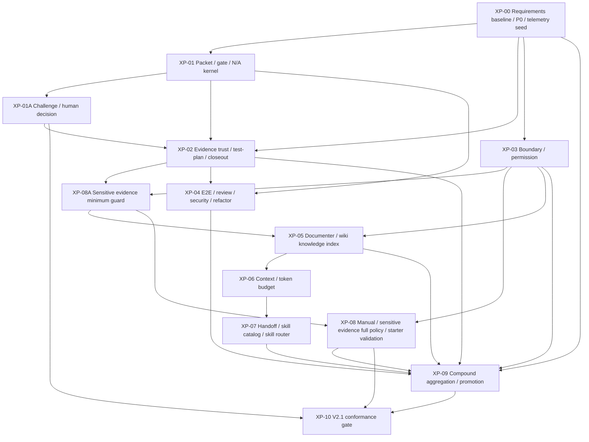

# Standard Harness V2.1 통합 작업계획서: 요구사항·아키텍처·구현계획 정본

> **Status:** V2.1 canonical work plan and Codex execution baseline  
> **Scope:** requirements + architecture + implementation plan  
> **Primary baseline:** `docs/requirements/standard-harness-integrated-requirements-v0.2.md`  
> **Working rule:** V2.1 is driven by v0.2 HR requirements and current repository implementation. Spreadsheet candidate requirements are not used as an intake basis for this plan.
> **Filename:** `docs/requirements/standard-harness-v2-1-integrated-work-plan.md`

---

## 0. 정본 목적

이 문서는 Standard Harness V2.1 개발의 기준 문서다. 목적은 현재 `standard-harness-v2` 구현을 통합 요구사항 v0.2에 맞춰 재정렬하고, 요구사항·아키텍처·구현계획을 하나의 실행 기준선으로 고정하는 것이다.

V2.1 작업은 새 기능을 임의로 추가하는 작업이 아니다. v0.2에서 정의한 좋은 하네스 기준을 `schema`, `policy`, `validator`, `gate`, `evidence`, `test`, `manual`로 낮추고, 현재 구현이 가진 final-product 기반 기능을 v0.2 운영 커널에 맞게 migration하는 작업이다.

---

## 1. 정본 원칙

```text
1. v0.2 HR이 V2.1의 요구사항 원천이다.
2. 현재 구현은 폐기하지 않고, reuse / modify / replace 판정을 통해 재정렬한다.
3. v1 harness 산출물은 직접 복사하지 않는다. 필요한 경우 원칙만 추출해 V2.1 구조로 재설계한다.
4. 문서·템플릿은 validator나 gate가 실제로 소비하는 경우에만 만든다.
5. Compound Engineering Harness는 후속 리포팅 기능이 아니라 V2.1/v1 필수 cross-cutting capability다.
6. 모든 XP는 HR coverage, migration/compatibility, acceptance test, release-blocking 조건을 가져야 한다.
```

---

## 2. V2.1 Source Of Truth

| 구분 | 파일 | 역할 |
|---|---|---|
| Primary requirements | `docs/requirements/standard-harness-integrated-requirements-v0.2.md` | V2.1 요구사항 원천 |
| Canonical work plan | `docs/requirements/standard-harness-v2-1-integrated-work-plan.md` | V2.1 요구사항·아키텍처·구현계획 정본 |
| Entry contract | `AGENTS.md` | Codex 진입 시 반드시 읽어야 하는 제품 방향 및 V2.1 기준 |
| Architecture inputs | `docs/architecture/standard-harness-architecture-guide-v1.md`, `docs/architecture/standard-harness-repository-topology-v1.md` | 현재 architecture baseline |
| Implementation inputs | `src/standard_harness/**`, `tests/**`, `tools/harness_cli.py` | 현재 구현 및 검증 자산 |
| Excluded intake | Spreadsheet candidate requirements | Not a V2.1 scope or requirement source unless explicitly reopened by the user |
| Legacy reference | v1.0 harness / `reference/legacy/v1/standard-harness-v1.zip` | Comparative evidence and skill-behavior reference only; no direct copy, bulk promotion, or V2.1 goal/scope change |
| Skill reference candidates | Superpowers skills, v1 harness skill behavior | Candidate skill patterns for catalog review; no direct adoption unless adapted to V2.1 contracts |
| External design references | Anthropic-style skill and context architecture patterns | Reference-only design evidence for progressive disclosure, procedural knowledge, provenance, and context curation; not a V2.1 requirement source, scope expansion, or XP ownership change |

---

## 3. V2.1 Execution Rules

### 3.1 Compound Engineering은 모든 XP에 걸친다

Compound Engineering Harness는 XP-09의 후반 리포트 기능이 아니다. XP-09는 집계·승격 엔진이고, XP-00부터 XP-08까지의 모든 validator/gate/workflow는 friction과 metric signal을 남길 수 있어야 한다.

```text
XP-00: friction/metric/improvement/starter-promotion base schema 정의
XP-01~XP-08: 각 validator/gate가 friction/metric signal emit
XP-09: recurring detector, success metrics, starter promotion candidate, harness packet promotion 구현
XP-10: Compound coverage가 없으면 V2.1 completion blocked
```

### 3.2 HR-003 비목표는 hard guardrail이다

v0.2 HR-003의 비목표는 단순 설명이 아니라 V2.1 guardrail로 내려야 한다.

| 금지/비목표 | V2.1 guardrail |
|---|---|
| 모든 LLM provider 완전 자동 제어 | provider adapter는 capability manifest와 manual fallback을 가져야 함 |
| 모든 패킷 병렬 자동 실행 | DAG/lock/workspace 조건 없이는 병렬 실행 지원 주장 금지 |
| 모든 작업에 동일한 full gate 적용 | gate profile과 rule-based N/A로 risk-tiered 적용 |
| 모든 skill의 무제한 core 내장 | core는 모든 skill을 무제한 내장하지 않는다. 단, V2.1에 필요한 skill은 skill catalog에 등록된 v2-native internal extension으로 구현할 수 있으며, 외부/v1 skill은 harness 계약(manifest, permission, evidence, fallback)을 만족하는 adapter를 통과할 때만 사용 |
| AI 리뷰만으로 품질 보증 | deterministic evidence 없이는 closeout 불가 |
| Wiki 자동 직접 갱신 | documenter는 proposal만 작성, wiki-applier만 반영 |
| 사용자의 모든 요청 무조건 수행 | challenge gate와 human decision 제한 적용 |
| 승인 없는 `_harness/**` 자동 수정 | harness packet과 human-approved path 없이 hard fail |

### 3.3 Sensitive evidence는 Wiki보다 먼저 막는다

Wiki proposal/apply 흐름이 열리기 전에 SECRET/SENSITIVE evidence blocking과 redaction stub이 먼저 있어야 한다. XP-05는 sensitive evidence 최소 차단 정책 없이 시작할 수 없다.

### 3.4 Conformance는 누적한다

XP-10에서 처음 conformance를 만드는 것이 아니다. XP-00부터 HR coverage matrix를 누적 갱신하고, XP-10은 누적된 coverage를 release-blocking final gate로 고정한다.

### 3.5 기존 V2 상태는 migration한다

V2.1은 현재 구현을 갈아엎지 않는다. schema-changing XP는 반드시 기존 DB/event/table/CLI/test와의 compatibility plan을 포함해야 한다.

### 3.6 V2.1 release boundary

V2.1 conformance must prove:

```text
- L0 complete
- L1 complete
- L4 Compound Engineering Harness complete
- L2 handoff baseline complete through handoff-first orchestration
- L3 parallel execution limited to DAG/lock/workspace metadata unless separately promoted
```

### 3.7 XP-00 first-run boundary and closed defaults

V2.1 implementation must start with XP-00 only unless the user explicitly authorizes a broader goal. XP-00 must close the baseline requirements model before XP-01 begins.

The following defaults are selected for XP-00:

| Decision point | V2.1 default |
|---|---|
| HR coverage artifact format | YAML canonical plus CSV/Markdown projections |
| Database migration style | XP-by-XP incremental migration with schema version bump |
| Starter policy mirroring | repo-root `_harness/**` is the development policy/schema root; starter reflection happens only through a starter-promotion packet |
| Wiki storage | Markdown files plus structured YAML/JSON index, with provenance metadata and projection-only skill-facing index |
| Required skill scope | XP-00 freezes the minimum required skill list; XP-07 may extend it through catalog review |
| V2.1 release boundary | release after XP-10, with XP-00 through XP-03 allowed as internal milestones |

XP-00 may not start until any change to these defaults is explicitly recorded as a design decision with owner and review timing.

### 3.8 v1.0 reference boundary

`reference/legacy/v1/standard-harness-v1.zip` may be referenced during V2.1 implementation to understand v1.0 behavior, friction patterns, skill candidates, prompts, manuals, and acceptance-test ideas.

This reference is one-way only:

```text
v1.0 can inform V2.1 implementation details.
v1.0 cannot change V2.1 goals, scope, priorities, architecture, source of truth, or definition of done.
```

Any v1.0 concept introduced into V2.1 must be re-specified against v0.2 HR requirements and V2.1 architecture, then classified as `reuse`, `modify`, `replace`, `create`, or `deprecate`. Direct import of v1.0 files, runtime state, generated state, `.agents`, `.harness`, plugins, or starter payload content remains blocked without explicit user approval and a documented promotion plan.

---

## 4. 현재 구현 대비 v0.2 Gap Matrix

| 그룹 | 주요 HR | 현재 구현 상태 | V2.1 gap | 판정 |
|---|---|---|---|---|
| G1. 기준선·metadata·P0 | HR-001V~HR-008 | state/event, conformance report, traceability 문서는 있음 | HR metadata index, traceability matrix, P0 policy, non-goal guardrail validator 부족 | P0 gap |
| G2. 레포 구조·경계 | HR-010R~HR-013 | starter contamination, gitops drift/reconciliation 있음 | logical zone mapping, git diff boundary validator, product packet `_harness/**` hard fail 부족 | P0 gap |
| G3. Multi-LLM handoff | HR-020R~HR-023R | adapter manifest/invocation, role cards, workflow/cloud orchestration 있음 | role-routing, handoff prompt generator, MANUAL_ONLY evidence intake 부족 | P1 gap |
| G4. Packet model | HR-030R~HR-033R | PacketService와 lifecycle 있음 | v0.2 state list, packet type, maturityLevel, DAG/lock metadata, gateProfileVersion 부족 | P0 gap |
| G5. Test/evidence/claim | HR-040R~HR-045 | evidence/claim/gate/closeout 기반은 강함 | trustStatus/validationStatus, test-plan-first gate, trusted closeout enforcement 부족 | P0 gap |
| G6. E2E/gate/N/A | HR-050R~HR-053 | browser/runtime contract 있음 | E2E applicability, browser evidence bundle, rule-based N/A, gate profile 부족 | P0 gap |
| G7. Domain/refactor | HR-060R, HR-061R, HR-090R | review 개념은 있으나 validator 약함 | domain boundary registry, refactor review validator 부족 | P1 gap |
| G8. Requirements/security/AI review | HR-070R~HR-081R | SSOT, review bundle, challenge, threat model 있음 | trigger-based applicability와 AI review bounded authority 강화 필요 | P1 gap |
| G9. Challenge/human decision | HR-150R~HR-152 | challenge/adjudication, human control snapshot 있음 | user request conflict validator, non-overridable human decision validator 부족 | P0 gap |
| G10. Documenter/Wiki | HR-100R~HR-111R | closeout DB record, operational memory 있음 | closeout report, wiki proposal validator, wiki-applier, `_ops/wiki/**` 구조 부족 | P0/P1 gap |
| G11. Context/sensitive evidence | HR-160R~HR-186 | current context projection, context router, redaction 일부 있음 | authority labels, role context pack, budget validator, evidence classification 부족 | P0/P1 gap |
| G12. Skill/permission | HR-130R~HR-131R, HR-180R~HR-182R | role cards, skill policy, adapter permission roots 일부 있음 | skill registry/router, agent permission policy, handoff CLI 부족 | P1 gap |
| G13. Manual/validator | HR-170R~HR-172R, HR-190R~HR-191 | command inventory, validation aggregator 있음 | validator catalog, HR-191 gate result metadata, manual runbook 부족 | P0/P1 gap |
| G14. Compound/metrics | HR-119R, HR-120R, HR-121R, HR-123R, HR-124R, HR-200 | friction record, improvement proposal 있음 | telemetry baseline, recurring detector, success metrics, starter promotion candidate, harness packet promotion 부족 | P0 gap |

---

## 5. HR Coverage Matrix Requirement

V2.1은 아래 구조의 coverage matrix를 XP-00에서 만들고, 각 XP closeout 때 갱신해야 한다.

```yaml
hrId: HR-043
title: evidence has trust status
coverageStatus: missing | partial | complete
xpOwner: XP-02
implementationDisposition: reuse | modify | replace | create
currentImplementation:
  - src/standard_harness/domain/evidence.py
targetArtifacts:
  schema:
    - _harness/schemas/evidence.schema.json
  policy:
    - _harness/policies/evidence-trust-policy.yaml
  validator:
    - src/standard_harness/validation/evidence_trust.py
  gate:
    - evidence-trust-gate
  tests:
    - tests/contract/test_evidence_trust_model_v02.py
releaseBlocking: true
lastUpdatedByPacket: null
```

Minimum required trace:

```text
HR → XP → file → schema/policy/validator/gate → evidence type → test → release-blocking status
```

---

## 6. Artifact Disposition Requirement

Each XP must classify current implementation artifacts before changing them.

| Field | Required values |
|---|---|
| artifact | existing or planned file/module/table/command |
| current role | what the artifact does in current V2 implementation |
| disposition | reuse, modify, replace, create, deprecate |
| reason | why this disposition matches v0.2 |
| migration impact | none, backfill, replay, audit, CLI compatibility, starter compatibility |
| required test | focused test that proves the disposition is safe |

Example:

| artifact | current role | disposition | reason | migration impact | required test |
|---|---|---|---|---|---|
| `src/standard_harness/domain/evidence.py` | result-status evidence registration | modify | keep event-backed service, add trustStatus/validationStatus | backfill, replay, audit | `tests.contract.test_evidence_trust_migration_compatibility` |

---

## 7. Architecture Target

V2.1 architecture는 현재 final-product 기능을 아래 운영 커널로 재정렬한다.

```text
Standard Harness V2.1
  = requirements metadata + HR coverage matrix
  + packet state machine
  + evidence trust model
  + claim ledger
  + gate profile engine
  + rule-based N/A engine
  + logical zone and permission boundary
  + documenter closeout and wiki proposal/apply flow
  + provider-neutral handoff router
  + context authority and token budget
  + sensitive evidence classifier
  + deterministic validator catalog
  + Compound Engineering telemetry and promotion loop
  + v0.2 full conformance gate
```

### 7.1 Canonical State Write Path And Artifact Write Authorities

V2.1 has exactly one canonical operational state write path:

```text
typed command or adapter output
→ validator
→ state mutation API
→ append-only event
→ rebuilt projection
```

The table below defines artifact write authorities only. Files under `_harness/**` or `_ops/**` do not become canonical operational state until registered through the state mutation API.

Path taxonomy:

| Path | Meaning | Rule |
|---|---|---|
| `.harness/**` | generated/local development runtime state if used by the current implementation | not a V2.1 source-of-truth policy root |
| `_harness/**` | V2.1 development repo policy/schema/source root | product packet cannot write |
| `_ops/**` | project operation evidence, packets, decisions, wiki proposals, wiki state | never included in clean starter payload |
| `starter/standard-harness/**` | clean starter payload seed | no product evidence, local state, logs, wiki, or secrets |
| `starter/standard-harness/.harness/**` | legacy/current starter seed path if present | migration target must be decided by starter-promotion packet |

Artifact authority table:

| 영역 | Artifact writer | 금지 사항 |
|---|---|---|
| `_harness/**` | harness packet / harness developer | product packet 직접 수정 금지 |
| `_ops/evidence/**` | validator, tester, documenter | SECRET evidence 무분류 등록 금지 |
| `_ops/wiki-proposals/**` | documenter | evidence link 없는 proposal 금지 |
| `_ops/wiki/**` | wiki-applier | documenter 직접 수정 금지 |
| starter payload | starter-promotion packet | 제품별 state/evidence/wiki/log/secret 포함 금지 |

### 7.2 Kernel Boundary Contract

| Boundary | Owned capability | Rule |
|---|---|---|
| Kernel-owned | state mutation API, append-only event log, packet state, evidence trust, claim ledger, gate profile/N/A, closeout, validator catalog | only typed validated inputs may mutate state |
| Policy-owned | P0 policy, gate profiles, zones, permissions, evidence classification, context authority, token budget | policy updates require harness policy packet |
| Extension-owned | adapters, handoff, skill router, documenter/wiki, dashboards, starter promotion, compound aggregation | extensions may propose or register typed outputs, but cannot mutate canonical state directly |
| Projection-owned | context packs, dashboards, reports, conformance reports | projections can be rebuilt from canonical events and policies |

### 7.3 Dependency Graph



---

## 8. Cross-Cutting Telemetry Contract

Every XP must either emit or explicitly mark N/A for the following signals.

```yaml
eventType: friction.signal
sourceXp: XP-02
packetId: PKT-EXAMPLE
signalType: repeated_test_failure | misunderstood_instruction | packet_scope_creep | docs_implementation_mismatch | missed_review | missing_e2e | missing_closeout | harness_file_contamination | misplaced_product_artifact | lost_long_term_context | token_overuse | unsafe_user_instruction_conflict | manual_rework | missing_evidence | stale_context | boundary_violation | docs_drift
severity: low | medium | high
observedAtGate: evidence-trust-gate
evidenceIds: []
dedupeKey: XP-02:evidence-trust:missing-trust-status
preventableByHarness: true
candidateFixType: schema | policy | validator | gate | docs | manual | starter
```

```yaml
eventType: metric.signal
sourceXp: XP-10
metricId: trusted_evidence_ratio
value: 0.82
unit: ratio
sourceEventRange: "1-120"
computedBy: success-metrics@v2.1
```

Release-blocking rule:

```text
If an XP introduces a new validator, gate, handoff path, wiki path, evidence path, or manual command path
and does not define friction/metric signal behavior,
that XP cannot close.

The signal taxonomy must cover every HR-120 observation target. If a new HR-120 observation target is added, XP-00 coverage and XP-09 recurring detection must be updated before V2.1 closeout.
```

---

## 9. Acceptance And Release-Blocking Convention

Each XP must distinguish planned focused tests from the regression command and must record the baseline before editing implementation files.

| Field | Meaning |
|---|---|
| Starting state | Run `git status --short` and record unrelated dirty files before the XP starts. |
| Baseline regression | Run `python -m unittest discover -s tests` before the XP starts. If it fails or hangs, report the blocker before mixing repair with XP scope. |
| Focused new tests to create | Test modules listed in each XP. They may not exist before the XP starts and must be created test-first. |
| RED confirmation | For changed behavior, the focused test must fail for the expected reason before implementation. |
| Regression command | `python -m unittest discover -s tests` must pass before XP closeout unless an explicit blocker is recorded. |
| Release-blocking enforcement | Each XP must map its release-blocking statements to validator IDs, gate IDs, diagnostic IDs, waiver policy, and enforcement point. |

XP release-blocking matrix format:

| XP | Validator | Gate ID | Diagnostic IDs | Waivable | Enforcement point |
|---|---|---|---|---|---|
| XP-00 | requirements-metadata-validator | requirements-baseline-gate | missing_hr_metadata, missing_traceability, non_goal_guardrail_missing | no | `validate`, V2.1 conformance |
| XP-01 | packet-schema-validator, gate-profile-validator, na-decision-validator | packet-kernel-gate | invalid_packet_schema, invalid_state_transition, missing_gate_profile, invalid_na_decision | no for P0 | `validate`, closeout |
| XP-01A | challenge-gate-validator, human-decision-validator | challenge-gate | missing_challenge_review, invalid_human_decision, non_overridable_override | no for HR-152 items | `validate`, closeout |
| XP-02 | evidence-trust-validator, test-plan-validator | evidence-trust-gate | untrusted_evidence, missing_test_plan, manual_only_evidence | conditional | closeout |
| XP-03 | boundary-validator, permission-validator | boundary-gate | harness_boundary_violation, forbidden_write_zone, invalid_zone_mapping | no for product `_harness/**` mutation | preflight, closeout |
| XP-08A | sensitive-evidence-validator | sensitive-evidence-gate | secret_evidence_registered, sensitive_wiki_promotion | no | evidence registration, wiki proposal |
| XP-05 | wiki-proposal-validator, closeout-report-validator, wiki-index-validator | wiki-governance-gate | missing_closeout_report, direct_wiki_write, invalid_wiki_proposal, missing_wiki_provenance, invalid_wiki_index, skill_facing_index_authority_violation | no for direct wiki write and authority override | closeout, wiki apply |
| XP-09 | recurring-friction-validator, success-metrics-validator | compound-engineering-gate | missing_compound_telemetry, missing_success_metrics, unlinked_starter_promotion_candidate | no for V2.1 completion | V2.1 conformance |
| XP-10 | validator-catalog-validator, v21-conformance-validator | v21-conformance-gate | missing_hr190_validator, missing_hr191_gate_metadata, incomplete_p0_coverage | no | release closeout |

---

## 10. V2.1 XP Plan

### XP-00. Requirements Baseline, P0 Policy, Guardrails, Telemetry Seed

Related HR: HR-001V, HR-002, HR-003, HR-004, HR-005, HR-006, HR-007, HR-008, HR-119R, HR-130R, HR-131R, HR-190R

Goal:

```text
Create the machine-readable V2.1 requirement baseline and guardrail foundation.
```

Current implementation basis:

```text
src/standard_harness/domain/requirements.py
src/standard_harness/completion/coverage.py
src/standard_harness/completion/final_gate.py
docs/requirements/standard-harness-conformance-map-v1.md
docs/requirements/standard-harness-conformance-trace-v1.csv
```

Architecture update:

```text
- Add HR coverage matrix as the canonical requirements projection.
- Add P0-Always/P0-Conditional policy boundary.
- Add HR-003 non-goal guardrail policy.
- Seed friction/metric/improvement/starter-promotion schemas for all later XP work.
- Freeze the minimum required skill list used by XP-00 through XP-06 until XP-07 expands it through the formal skill catalog.
```

Implementation plan:

```text
Create: _harness/contracts/requirements-index.yaml
Create: _harness/contracts/traceability-matrix.yaml
Create: _harness/contracts/hr-coverage-matrix.yaml
Create: _harness/policies/p0-policy.yaml
Create: _harness/policies/non-goal-guardrails.yaml
Create: _harness/catalog/minimum-required-skills.yaml
Create: _harness/schemas/friction-signal.schema.json
Create: _harness/schemas/metric-signal.schema.json
Create: src/standard_harness/contracts/metadata.py
Create: src/standard_harness/validation/requirements_metadata.py
Modify: src/standard_harness/validation/aggregator.py
```

Minimum required skill list:

```text
- SKILL-TDD-IMPLEMENTATION
- SKILL-EVIDENCE-TRUST-VALIDATION
- SKILL-BOUNDARY-VALIDATION
- SKILL-CLOSEOUT-DOCUMENTER
- SKILL-WIKI-PROPOSAL-VALIDATION
- SKILL-CONTEXT-PACK-GENERATION
- SKILL-FRICTION-ANALYSIS
```

Migration/compatibility:

```text
- Existing requirement rows remain valid but map to partial HR coverage until metadata is added.
- Existing conformance CSV/MD files are treated as legacy inputs, not canonical V2.1 coverage.
```

Acceptance test command:

```powershell
python -m unittest tests.contract.test_requirements_metadata_validator tests.contract.test_non_goal_guardrails
python -m unittest discover -s tests
```

Release-blocking:

```text
V2.1 cannot proceed past XP-00 if HR metadata, traceability, P0 policy, non-goal guardrail policy, and telemetry base schemas are missing.
V2.1 conformance must prove L0/L1/L4 complete, L2 handoff baseline complete, and L3 parallel execution limited to metadata unless separately promoted.
```

### XP-01. Packet State, Gate Profile, Rule-Based N/A Kernel

Related HR: HR-030R, HR-031R, HR-032R, HR-033R, HR-052, HR-053, HR-190R, HR-191

Goal:

```text
Align packet and gate kernel with v0.2 state, metadata, and gate applicability rules.
```

Current implementation basis:

```text
src/standard_harness/domain/packets.py
src/standard_harness/domain/gates.py
src/standard_harness/policy/profiles.py
src/standard_harness/validation/aggregator.py
```

Architecture update:

```text
- Packet state machine becomes the root of all implementation work.
- Gate profile engine determines which validators apply.
- N/A decisions are structured records, not free-form rationale.
```

Implementation plan:

```text
Create: _harness/schemas/packet.schema.json
Create: _harness/schemas/gate-result.schema.json
Create: _harness/schemas/na-decision.schema.json
Create: _harness/policies/gate-profiles.yaml
Create: src/standard_harness/policy/gate_profiles.py
Create: src/standard_harness/validation/na_decisions.py
Modify: src/standard_harness/domain/packets.py
Modify: src/standard_harness/domain/gates.py
Modify: src/standard_harness/state/migrations.py
Modify: src/standard_harness/state/replay.py
Modify: src/standard_harness/state/audit.py
```

Migration/compatibility:

```text
- Map current lifecycle states to v0.2 states.
- Existing `risk_class` maps to `riskLevel`.
- Existing `change_zones` maps to `changeZones`.
- Existing gate result rows get default policyVersion/gateProfileVersion/validatorVersion during migration.
```

Acceptance test command:

```powershell
python -m unittest tests.contract.test_v02_packet_schema tests.contract.test_gate_profile_applicability tests.contract.test_rule_based_na_decision
```

Release-blocking:

```text
Any packet without valid schema, gateProfileVersion, state transition, or rule-based N/A must block closeout.
```

### XP-01A. Challenge Gate And Human Decision Policy

Related HR: HR-150R, HR-151R, HR-152

Goal:

```text
Implement challenge gate applicability and non-overridable human decision limits as P0-Conditional behavior.
```

Current implementation basis:

```text
src/standard_harness/reviews/adjudication.py
src/standard_harness/memory/human_control_snapshot.py
tests/contract/test_challenge_review_adjudication.py
tests/contract/test_human_control_snapshot.py
```

Architecture update:

```text
- User requests are inputs, not automatic truth.
- Challenge triggers create gate results and decision records.
- HR-152 non-overridable items cannot be bypassed by waiver, profile, or human decision.
```

Implementation plan:

```text
Create: _harness/policies/challenge-gate.yaml
Create: _harness/schemas/human-decision.schema.json
Create: src/standard_harness/validation/challenge_gate.py
Create: src/standard_harness/validation/human_decision.py
Create: _ops/decisions/records/.gitkeep
Modify: src/standard_harness/reviews/adjudication.py
Modify: src/standard_harness/memory/human_control_snapshot.py
Modify: src/standard_harness/validation/aggregator.py
```

Migration/compatibility:

```text
- Existing challenge/adjudication records remain review evidence.
- Existing human control snapshots become projections, not override authority.
- Existing waivers must be checked against HR-152 non-overridable items.
```

Acceptance test command:

```powershell
python -m unittest tests.contract.test_challenge_gate_applicability tests.contract.test_human_decision_non_overridable_items tests.contract.test_challenge_review_required_for_p0_exception
```

Release-blocking:

```text
Risky user requests and P0 exception requests require challenge gate evidence. HR-152 non-overridable items cannot be bypassed by human decision.
```

### XP-02. Evidence Trust, Test-Plan-First, Claim Ledger Closeout

Related HR: HR-040R, HR-041R, HR-042R, HR-043, HR-044, HR-045

Goal:

```text
Replace result-status-only evidence with v0.2 trusted evidence and test-plan-first gates.
```

Current implementation basis:

```text
src/standard_harness/domain/evidence.py
src/standard_harness/evidence/runtime.py
src/standard_harness/evidence/profiles.py
src/standard_harness/domain/closeout.py
tests/contract/test_evidence_claims.py
tests/evals/test_missing_evidence_blocks_completion.py
```

Architecture update:

```text
- Evidence has both validationStatus and trustStatus.
- `passed` is not equivalent to trusted.
- Closeout depends on trusted evidence, supported claims, and active gate results.
```

Implementation plan:

```text
Create: _harness/schemas/evidence.schema.json
Create: _harness/policies/evidence-trust-policy.yaml
Create: src/standard_harness/evidence/trust.py
Create: src/standard_harness/validation/test_plan.py
Create: src/standard_harness/validation/evidence_trust.py
Modify: src/standard_harness/domain/evidence.py
Modify: src/standard_harness/domain/closeout.py
Modify: src/standard_harness/state/migrations.py
Modify: src/standard_harness/state/replay.py
Modify: src/standard_harness/state/audit.py
```

Migration/compatibility:

```text
- Existing evidence.result_status='passed' migrates to validationStatus=STRUCTURALLY_VALID unless reproduced by harness or trusted CI.
- Existing evidence without producer/source commit metadata is MANUAL_ONLY or RECORDED.
- Existing supported claims remain supported only if linked evidence becomes trusted.
```

Acceptance test command:

```powershell
python -m unittest tests.contract.test_evidence_trust_model_v02 tests.contract.test_test_plan_first_gate tests.contract.test_evidence_trust_migration_compatibility tests.evals.test_manual_only_evidence_cannot_closeout
```

Release-blocking:

```text
Code/runtime behavior changes cannot close without trusted evidence. MANUAL_ONLY evidence cannot close without allowed human decision.
```

### XP-03. Logical Zone Mapping, Boundary Validator, Agent Permission Policy

Related HR: HR-010R, HR-011R, HR-012R, HR-013, HR-180R, HR-181R, HR-182R

Goal:

```text
Make repository boundaries and agent write permissions deterministic and diff-based.
```

Current implementation basis:

```text
src/standard_harness/starter/contamination.py
src/standard_harness/starter/manifest.py
src/standard_harness/adapters/contract_matrix.py
src/standard_harness/gitops/drift.py
src/standard_harness/gitops/reconciliation.py
```

Architecture update:

```text
- Logical zone mapping supports existing projects without requiring physical `product/`.
- Boundary validation uses git diff, packet type, role, and allowed/forbidden zones.
- Product packets cannot mutate `_harness/**`.
```

Implementation plan:

```text
Create: _harness/policies/zones.yaml
Create: _harness/policies/agent-permissions.yaml
Create: src/standard_harness/policy/zones.py
Create: src/standard_harness/policy/permissions.py
Create: src/standard_harness/validation/boundary.py
Modify: src/standard_harness/validation/aggregator.py
Modify: src/standard_harness/starter/contamination.py
```

Migration/compatibility:

```text
- Existing starter contamination checks remain but become one validator under boundary/starter policy.
- Existing adapter permission roots map to role-based allowedWriteZones.
```

Acceptance test command:

```powershell
python -m unittest tests.contract.test_logical_zone_mapping tests.contract.test_git_diff_boundary_validator tests.evals.test_product_packet_cannot_modify_harness
```

Release-blocking:

```text
Product packet modifying `_harness/**` is non-overridable hard fail.
```

### XP-08A. Sensitive Evidence Minimum Guard

Scope:

```text
XP-08A is the minimum sensitive-evidence guard split out from XP-08.
It must exist before XP-05 enables Wiki proposal/application.
The full manual, starter, retention, screenshot classification, and runbook work remains in XP-08.
```

Related HR: HR-110R, HR-162, HR-163, HR-185, HR-186

Goal:

```text
Install the minimum sensitive evidence guard required before Wiki proposal/application can be enabled.
```

Current implementation basis:

```text
src/standard_harness/security/redaction.py
src/standard_harness/security/privacy.py
src/standard_harness/retention/policies.py
```

Implementation plan:

```text
Create: _harness/policies/evidence-classification.yaml
Create: src/standard_harness/security/evidence_classification.py
Create: src/standard_harness/validation/sensitive_evidence.py
Modify: src/standard_harness/domain/evidence.py
```

Migration/compatibility:

```text
- Existing evidence gets INTERNAL classification by default unless secret scan flags it.
- SECRET/SENSITIVE evidence cannot be promoted to Wiki or LLM handoff context.
```

Acceptance test command:

```powershell
python -m unittest tests.contract.test_sensitive_evidence_classification tests.evals.test_secret_evidence_registration_blocked
```

Release-blocking:

```text
XP-05 cannot begin until SECRET/SENSITIVE evidence promotion block exists.
```

### XP-05. Closeout Documenter, Evidence-Backed Wiki, Knowledge Index

Related HR: HR-100R, HR-101R, HR-102R, HR-110R, HR-111R

Goal:

```text
Create an evidence-backed documenter, validated Wiki proposal/apply flow, and structured Wiki knowledge index that later context packs and skill routers can consume without treating stale, generated, or unprovenanced summaries as source of truth.
```

Reference boundary:

```text
Anthropic-style skill and context architecture is used only as a design reference for XP-05 Wiki knowledge structuring, provenance, progressive disclosure, and skill-facing knowledge projection. It does not change the V2.1 source of truth, HR scope, release boundary, or XP-07 ownership of skill catalog, routing, and execution.
```

Architecture update:

```text
- Wiki is not a free-form documentation dump. It is a structured knowledge projection backed by trusted evidence, packet closeout reports, decision records, and validated proposals.
- Wiki pages must carry entry type, source tier, provenance, owner, review status, related HR/XP/packet IDs, and evidence links.
- Generated summaries cannot override requirements, policies, gate results, human decisions, or trusted evidence.
- XP-05 owns the Wiki knowledge map and skill-facing index only. Runtime skill catalog, routing, and execution remain XP-07 responsibilities.
- Stale, low-authority, or generated Wiki content must emit docs_drift or stale_context friction signals and must not be promoted into high-authority context without the XP-06 context authority rules.
```

Current implementation basis:

```text
src/standard_harness/domain/closeout.py
src/standard_harness/memory/operational.py
src/standard_harness/projection/current_context.py
src/standard_harness/dashboard/read_model.py
```

Implementation plan:

```text
Create: src/standard_harness/documenter/closeout_report.py
Create: src/standard_harness/wiki/proposals.py
Create: src/standard_harness/wiki/validator.py
Create: src/standard_harness/wiki/applier.py
Create: src/standard_harness/wiki/index.py
Create: src/standard_harness/wiki/provenance.py
Create: _harness/schemas/wiki-proposal.schema.json
Create: _harness/schemas/wiki-page.schema.json
Create: _harness/schemas/wiki-index.schema.json
Create: _harness/policies/wiki-knowledge-policy.yaml
Create: _ops/wiki/index.yaml
Create: _ops/wiki/architecture.md
Create: _ops/wiki/decision-log.md
Create: _ops/wiki/packet-history.md
Create: _ops/wiki/current-conventions.md
Create: _ops/wiki/known-frictions.md
Create: _ops/wiki/agent-lessons.md
Create: _ops/wiki/deprecated-context.md
Create: _ops/wiki/skill-facing-index.md
Modify: src/standard_harness/validation/aggregator.py
```

Migration/compatibility:

```text
- Existing operational memory snapshots are source evidence, not direct Wiki state.
- Existing closeout DB rows can generate historical closeout reports only after evidence trust migration.
- Existing Wiki-like summaries remain low-authority generated context until linked to trusted evidence and applied through validated proposals.
- Historical packet history entries require source tier, provenance, owner, review status, and evidence links before they can become authoritative Wiki state.
- `skill-facing-index.md` is a projection for later XP-07 routing and cannot define, execute, or authorize skills.
```

Acceptance test command:

```powershell
python -m unittest tests.contract.test_closeout_documenter_report tests.contract.test_wiki_proposal_validator tests.contract.test_wiki_applier_requires_validated_proposal tests.contract.test_wiki_page_schema tests.contract.test_wiki_index_contract tests.contract.test_wiki_provenance_required tests.contract.test_skill_facing_index_is_projection_only
```

Release-blocking:

```text
Wiki mutation without validated proposal must fail. Documenter direct write to `_ops/wiki/**` must fail. Wiki pages without entry type, source tier, provenance, owner, review status, related HR/XP/packet IDs, and evidence links cannot be promoted to authoritative Wiki state. Stale, low-authority, or generated Wiki content cannot override requirements, policies, gate results, trusted evidence, or human decision records. Skill-facing Wiki projections cannot execute or authorize skills.
```

### XP-04. E2E Applicability, Browser Evidence, Requirements/Security/Refactor Gates

Related HR: HR-050R, HR-051R, HR-052, HR-060R, HR-061R, HR-070R, HR-071R, HR-080R, HR-081R, HR-090R

Goal:

```text
Connect risk-based review gates and browser validation to packet/gate profile policy.
```

Current implementation basis:

```text
src/standard_harness/runtime/browser_contract.py
src/standard_harness/evidence/runtime.py
src/standard_harness/security/threat_model.py
src/standard_harness/reviews/bundles.py
src/standard_harness/reviews/adjudication.py
```

Implementation plan:

```text
Create: _harness/schemas/e2e-applicability.schema.json
Create: _harness/schemas/browser-evidence-bundle.schema.json
Create: _harness/policies/security-triggers.yaml
Create: _harness/policies/domain-boundaries.yaml
Create: src/standard_harness/validation/e2e_applicability.py
Create: src/standard_harness/validation/requirements_review.py
Create: src/standard_harness/validation/security_review.py
Create: src/standard_harness/domain/boundaries.py
Create: src/standard_harness/validation/refactor_review.py
Modify: src/standard_harness/domain/closeout.py
```

Migration/compatibility:

```text
- Existing browser/runtime contract tests remain adapter contract tests.
- Existing threat model records become security review evidence only when trigger applicability passes.
```

Acceptance test command:

```powershell
python -m unittest tests.contract.test_e2e_applicability_gate tests.contract.test_security_trigger_applicability tests.contract.test_refactor_domain_boundary_gate
```

Release-blocking:

```text
UI/auth/routing/core user flow changes require E2E_REQUIRED or E2E_SMOKE_REQUIRED. Security triggers require security gate.
```

### XP-06. Context Authority And Token Budget

Related HR: HR-160R, HR-161R, HR-162, HR-163

Goal:

```text
Make context packs role-specific, authority-labelled, and budget-governed.
```

Current implementation basis:

```text
src/standard_harness/projection/current_context.py
src/standard_harness/reviews/routing.py
src/standard_harness/dashboard/read_model.py
```

Implementation plan:

```text
Create: _harness/policies/context-authority.yaml
Create: _harness/policies/token-budget.yaml
Create: src/standard_harness/context/authority.py
Create: src/standard_harness/context/packs.py
Create: src/standard_harness/context/budget.py
Create: src/standard_harness/validation/context_budget.py
Modify: src/standard_harness/projection/current_context.py
Modify: src/standard_harness/reviews/routing.py
```

Migration/compatibility:

```text
- Existing current_context projection remains a source, but V2.1 context packs must add authority labels.
- Existing ContextRouter diagnostics map to authority override diagnostics.
```

Acceptance test command:

```powershell
python -m unittest tests.contract.test_context_authority_labels tests.contract.test_role_specific_context_pack tests.contract.test_token_context_budget_validator
```

Release-blocking:

```text
Stale or untrusted content cannot override policy, packet instructions, gate results, or decisions.
```

### XP-07. Provider-Neutral Handoff Router, Skill Catalog, Required Skill Implementations, Agent Run CLI

Related HR: HR-020R, HR-021R, HR-022R, HR-023R, HR-130R, HR-131R

Goal:

```text
Create provider-neutral handoff, a required skill catalog, v2-native required skill implementations, and skill routing without making any provider or v1 artifact the core source of truth.
```

Current implementation basis:

```text
src/standard_harness/adapters/manifest.py
src/standard_harness/adapters/invocation.py
src/standard_harness/roles/cards.py
src/standard_harness/roles/skill_policy.py
src/standard_harness/workflow/orchestration.py
src/standard_harness/cloud/orchestration.py
reference/legacy/v1/standard-harness-v1.zip (reference-only skill behavior and friction patterns)
Superpowers skills (reference-only process skill candidates: TDD, debugging, review, planning, verification, parallel agents, subagent development)
```

Implementation plan:

```text
Create: _harness/policies/role-routing.yaml
Create: _harness/examples/role-routing.codex-claude.yaml
Create: _harness/schemas/handoff-prompt.schema.json
Create: _harness/schemas/skill-catalog.schema.json
Create: _harness/schemas/skill-execution.schema.json
Create: _harness/catalog/skill-catalog.yaml
Create: src/standard_harness/handoff/prompts.py
Create: src/standard_harness/handoff/intake.py
Create: src/standard_harness/skills/catalog.py
Create: src/standard_harness/skills/router.py
Create: src/standard_harness/skills/internal/
Modify: src/standard_harness/adapters/manifest.py
Modify: src/standard_harness/cli/main.py
```

Skill implementation policy:

```text
- V2.1 must implement skills required by v0.2/XP execution when no compliant existing skill is available.
- Required skills are implemented as v2-native internal extensions, not as ad hoc core branches.
- Skill catalog is mandatory and records id, purpose, owner, source, permission scope, input/output schema, evidence contract, fallback behavior, validation command, and HR/XP trace.
- `reference/legacy/v1/standard-harness-v1.zip` is the reference for candidate skill behavior and acceptance-test ideas only. Do not copy v1 skill files, prompts, runtime state, or plugin structure without an explicit promotion plan.
- Superpowers skills are major reference candidates for workflow/process skills. They may inform V2.1 skill behavior, naming, checks, and acceptance tests, but any adopted capability must be represented as a cataloged V2.1 skill or adapter with harness-native permission, evidence, fallback, and validation contracts.
- External skills may be used only through adapters that satisfy the same catalog, permission, evidence, and fallback contracts. If an external/v1 skill does not fit V2.1 architecture, implement the V2.1 skill instead.
```

Migration/compatibility:

```text
- Existing adapter manifests map to provider capability manifests.
- Existing role cards remain but are linked from role-routing policy.
- Manual handoff output becomes MANUAL_ONLY evidence by default.
- v1 zip skill behavior maps to catalog entries and tests as reference evidence, not as imported runtime code.
```

Acceptance test command:

```powershell
python -m unittest tests.contract.test_role_routing_policy tests.contract.test_handoff_prompt_contract tests.contract.test_manual_handoff_evidence_classification tests.contract.test_skill_catalog_contract tests.contract.test_required_skill_implementation_registry tests.contract.test_skill_router_evidence_contract tests.contract.test_v1_skill_reference_traceability
```

Release-blocking:

```text
Provider-specific behavior cannot be required by the core kernel. Required skills cannot be invoked outside the catalog. Skill routing cannot bypass P0 gates. v1-referenced skill behavior must be traceable and reimplemented/adapted through V2.1 contracts before use.
```

### XP-08. Manual Runbook, Sensitive Evidence Full Policy, Starter Validation

Related HR: HR-170R, HR-171R, HR-172R, HR-185, HR-186

Goal:

```text
Complete sensitive evidence handling, human manual accuracy, and starter validation.
```

Current implementation basis:

```text
src/standard_harness/docsops/command_inventory.py
src/standard_harness/docsops/freshness.py
src/standard_harness/security/redaction.py
src/standard_harness/security/privacy.py
src/standard_harness/retention/policies.py
src/standard_harness/starter/contamination.py
```

Implementation plan:

```text
Create: docs/manual/standard-harness-runbook-v21.md
Create: docs/manual/standard-harness-troubleshooting-v21.md
Modify: _harness/policies/evidence-classification.yaml
Modify: src/standard_harness/security/evidence_classification.py
Modify: src/standard_harness/validation/sensitive_evidence.py
Modify: src/standard_harness/docsops/command_inventory.py
Modify: docs/release/final-product-docs-command-inventory-v1.md
```

Migration/compatibility:

```text
- Existing command inventory remains but is reclassified by command/install/closeout path.
- Existing starter contamination checks become part of V2.1 starter validation.
```

Acceptance test command:

```powershell
python -m unittest tests.contract.test_manual_runbook_command_validation tests.contract.test_sensitive_evidence_classification tests.contract.test_starter_boundary
```

Release-blocking:

```text
Outdated command on command/install/closeout path blocks release. SECRET evidence in handoff context blocks release.
```

### XP-09. Compound Engineering Harness Aggregation And Promotion

Related HR: HR-119R, HR-120R, HR-121R, HR-123R, HR-124R, HR-200

Note: HR-122R is not defined in v0.2 and is reserved. V2.1 must enumerate Compound Engineering HR IDs individually rather than using an ambiguous range.

Goal:

```text
Implement the V2.1 Compound Engineering aggregation, promotion, metrics, and starter feedback loop.
```

Current implementation basis:

```text
src/standard_harness/self_improvement/friction.py
src/standard_harness/self_improvement/proposals.py
src/standard_harness/pmo/cost.py
src/standard_harness/pmo/projections.py
tests/contract/test_self_improvement_lifecycle.py
```

Implementation plan:

```text
Create: src/standard_harness/self_improvement/recurring.py
Create: src/standard_harness/self_improvement/starter_promotion.py
Create: src/standard_harness/metrics/success.py
Create: _harness/schemas/starter-promotion-candidate.schema.json
Create: _ops/backlog/harness-improvement-backlog.md
Modify: src/standard_harness/self_improvement/proposals.py
Modify: src/standard_harness/domain/packets.py
Modify: src/standard_harness/state/migrations.py
Modify: src/standard_harness/state/replay.py
Modify: src/standard_harness/state/audit.py
Modify: src/standard_harness/completion/coverage.py
```

Migration/compatibility:

```text
- Existing friction_records map to friction.signal records.
- Existing improvement_proposals get disposition migration.
- Existing PMO/cost records can feed HR-200 metrics where applicable.
```

Acceptance test command:

```powershell
python -m unittest tests.contract.test_recurring_friction_detector tests.contract.test_success_metrics_report tests.contract.test_starter_promotion_candidate_registry tests.contract.test_compound_event_replay_compatibility tests.evals.test_compound_engineering_required_for_v1_completion
```

Release-blocking:

```text
V2.1 cannot complete without recurring friction detector, HR-200 metrics report, and evidence-linked starter promotion candidate registry.
```

### XP-10. V2.1 Full Conformance Gate And Release Closeout

Related HR: all HR, especially HR-190R, HR-191, HR-200

Goal:

```text
Finalize cumulative HR coverage as the V2.1 release-blocking conformance gate.
```

Current implementation basis:

```text
src/standard_harness/validation/aggregator.py
src/standard_harness/completion/final_gate.py
src/standard_harness/completion/coverage.py
docs/release/final-product-conformance-report-v1.md
```

Implementation plan:

```text
Create: _harness/policies/validator-catalog.yaml
Create: src/standard_harness/validation/catalog.py
Create: src/standard_harness/completion/v21_conformance.py
Create: docs/release/v21-conformance-report.md
Modify: src/standard_harness/validation/aggregator.py
Modify: src/standard_harness/completion/final_gate.py
Modify: docs/release/release-quality-closeout-v1.md
```

Migration/compatibility:

```text
- Existing project completion gate remains but delegates V2.1 completion to v21_conformance.
- Existing release docs become historical final-product artifacts unless updated to V2.1.
```

Acceptance test command:

```powershell
python -m unittest tests.contract.test_validator_catalog_hr190_coverage tests.contract.test_v21_full_conformance_gate
```

Release-blocking:

```text
Any incomplete P0 HR coverage, missing HR-190R validator, missing HR-191 gate metadata, or missing XP-09 compound coverage blocks V2.1 completion.
```

---

## 11. Migration Risk Register

| Risk | Affected XP | Detection | Mitigation | Rollback | Release-blocking test |
|---|---|---|---|---|---|
| DB/event schema version drift | XP-01, XP-02, XP-09 | migration checksum and replay failure | versioned migration plus replay/audit update | restore backup and revert migration packet | `tests.contract.test_state_replay_compatibility` plus XP-specific migration tests |
| Legacy conformance CSV/MD treated as canonical | XP-00, XP-10 | HR coverage matrix mismatch | mark legacy conformance as input only, generate V2.1 coverage | keep legacy files read-only | `tests.contract.test_v21_full_conformance_gate` |
| Evidence trust downgrade blocks historical closeout | XP-02 | trusted evidence ratio drop and closeout failures | migrate old evidence to conservative trustStatus with rationale | preserve old evidence rows and add mapped fields | `tests.contract.test_evidence_trust_migration_compatibility` |
| Gate metadata defaulting hides unknowns | XP-01, XP-10 | missing policyVersion/gateProfileVersion/validatorVersion | default to migrated_unknown and block final conformance until reviewed | keep prior gate rows and add migration annotations | `tests.contract.test_gate_profile_applicability` |
| Starter path relocation contaminates payload | XP-03, XP-08, XP-09 | starter contamination validator | mirror only approved policy/schema artifacts into starter | revert starter promotion packet | `tests.contract.test_starter_boundary` |
| Wiki or handoff leaks sensitive evidence | XP-08A, XP-05, XP-07 | sensitive evidence validator | classify before proposal/apply/handoff | reject proposal and remove generated artifact | `tests.evals.test_secret_evidence_registration_blocked` |
| CLI backward compatibility break | XP-01, XP-02, XP-07, XP-10 | README/manual command inventory and CLI integration tests | keep aliases or documented migration commands | restore prior CLI command path | `python -m unittest discover -s tests` |

---

## 12. V2.1 Recommended Execution Order

```text
1. XP-00 Requirements baseline / P0 / guardrails / telemetry seed
2. XP-01 Packet / gate / N/A kernel
3. XP-01A Challenge / human decision
4. XP-02 Evidence trust / test-plan / closeout
5. XP-03 Boundary / permission
6. XP-08A Sensitive evidence minimum guard
7. XP-05 Documenter / wiki
8. XP-04 E2E / requirements / security / refactor gates
9. XP-06 Context / token budget
10. XP-07 Handoff / skill catalog / skill router
11. XP-08 Manual / sensitive evidence full policy / starter validation
12. XP-09 Compound Engineering aggregation / promotion
13. XP-10 Full conformance gate
```

XP-04 is serially listed after XP-05 for operational readability, but parts of XP-04 can run in parallel after XP-02 and XP-03. XP-09 is late in execution order only because it aggregates signals emitted by earlier XP work. It is still V2.1/v1 required.

XP-09 is late only as an aggregation implementation. XP-00 must create telemetry schemas, and XP-01 through XP-08 must emit or explicitly mark N/A friction/metric signals. Any XP that omits telemetry behavior is incomplete.

---

## 13. V2.1 Definition Of Done

V2.1 is complete only when all conditions below are met.

```text
[ ] Every v0.2 HR has coverageStatus complete or documented non-applicability.
[ ] Every P0-Always requirement is implemented as a non-waivable validator/gate.
[ ] Every P0-Conditional requirement has a gate applicability rule.
[ ] All schema-changing XP work includes migration/compatibility evidence.
[ ] Evidence trust model blocks untrusted closeout.
[ ] Rule-based N/A blocks free-form N/A.
[ ] Product packet `_harness/**` mutation is hard fail.
[ ] Documenter cannot write `_ops/wiki/**` directly.
[ ] SECRET/SENSITIVE evidence cannot be promoted to Wiki or handoff context.
[ ] HR-003 non-goal guardrails are implemented.
[ ] Required V2.1 skills are implemented or adapted through the mandatory skill catalog.
[ ] Compound telemetry exists across XP workstreams.
[ ] HR-200 success metrics report is generated.
[ ] Starter promotion candidates require friction, metric, or harness-packet closeout evidence.
[ ] Validator catalog covers HR-190R.
[ ] Gate results include HR-191 metadata.
[ ] V2.1 conformance gate passes.
```

---

## 14. Pre-XP-00 Decisions

These decisions are closed defaults for starting XP-00. They do not reopen the requirement intake basis and do not authorize v1 artifact promotion or spreadsheet-derived scope changes. If a default must change, record a design decision before XP implementation.

| Topic | Closed V2.1 decision | Applies from |
|---|---|---|
| HR coverage artifact format | YAML canonical plus CSV/Markdown projections | XP-00 |
| Database migration style | XP-by-XP incremental migration with schema version bump | XP-00 |
| Starter policy mirroring | repo-root `_harness/**` remains the development policy/schema root; starter reflection only through a starter-promotion packet | XP-00, XP-03, XP-08, XP-09 |
| Wiki storage | Markdown files plus structured YAML/JSON index, with provenance metadata and projection-only skill-facing index | XP-05 |
| Required skill scope | XP-00 freezes the minimum required skill list; XP-07 owns catalog schema, router, and extension/adaptation boundary | XP-00, XP-07 |
| V2.1 release boundary | release after XP-10; XP-00 through XP-03 may be internal milestones only | XP-00, XP-10 |
