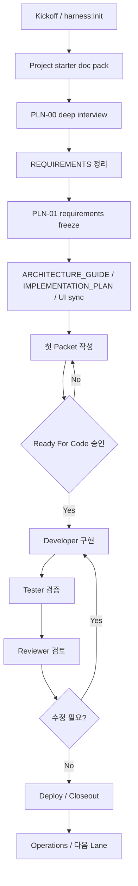
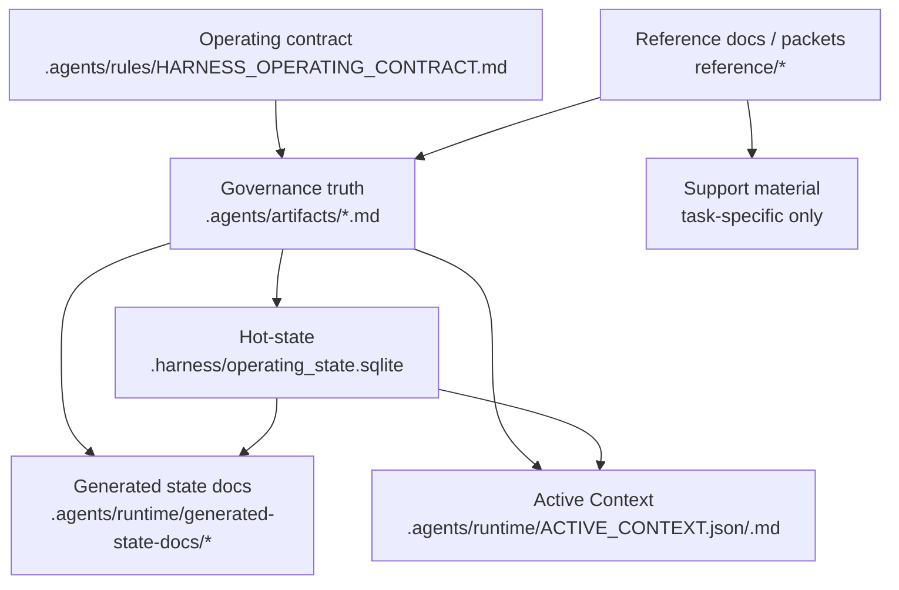

# Operations

## 3. 전체 생명주기

하네스는 아래 순서를 기본값으로 본다.

### 3.1 End-to-end operator journey

처음 사용하는 운영자는 아래 흐름을 전체 프로젝트의 기본 지도처럼 읽는다. `START_HERE.md`는 1~2단계의 kickoff pointer이고, 이 manual은 kickoff 이후 매 작업과 배포까지 이어지는 primary guide다.

| 단계 | 사용자가 해야 할 일 | 기준 문서/명령 | 다음 판단 |
|---:|---|---|---|
| 1 | 최초 적용 준비 | 새 프로젝트인지 기존 프로젝트인지 정하고 Node.js 24+, repo root, optional profile 후보를 준비한다. | `START_HERE.md`, `README.md` | `harness:init` 또는 migration preview로 갈지 결정 |
| 2 | Kick-off baseline | 목적, 사용자, 업무흐름, 데이터, 권한, 테스트, 운영 기준을 rough baseline으로 채운다. | `PROJECT_STARTER_DOC_PACK.md`, `PLN-00`, `REQUIREMENTS.md`, `PLN-01` | requirements freeze가 충분한지 결정 |
| 3 | 첫 packet 준비 | scope, acceptance, risk class, route class, gate profile, required Planner Packet Challenge Review, Ready For Code를 닫는다. | plan workflow, active packet, `HARNESS_FILE_ROUTE_AUDIT_MATRIX.md` | Developer 진입 또는 hold |
| 4 | 매 작업 실행 | Developer가 승인 범위 안에서 구현하고 Tester/Reviewer가 evidence로 닫는다. | dev/test/review workflows, validation report, walkthrough/review evidence | remediation, closeout, 또는 split |
| 5 | Planner closeout | evidence, residual risk, deferred follow-up, 다음 owner/action을 정리한다. | packet exit quality gate, `IMPLEMENTATION_PLAN.md`, `ACTIVE_CONTEXT` | 다음 packet, hold, 또는 release/cutover packet |
| 6 | 배포/운영 | 배포 대상, 실행자, rollback boundary, release evidence를 별도 packet으로 닫는다. | deploy workflow, `DEPLOYMENT_PLAN.md`, release/cutover packet | deploy, rollback, hold 중 결정 |

전체 흐름은 `kickoff -> requirements freeze -> packet -> Developer -> Tester -> Reviewer -> Planner closeout -> deployment/cutover packet when needed`로 기억하면 된다. 각 단계에서 확인할 것은 네 가지다: 다음 workflow, 승인 경계, 필요한 evidence, 멈춰야 할 조건.

### 3.1A LLM-era operating model

LLM-era 하네스 운영의 핵심은 AI에게 더 많은 일을 한 번에 맡기는 것이 아니라, 사람이 승인해야 할 경계와 AI가 처리할 수 있는 실행 단계를 분리하는 것이다. 사용자는 아래 표를 먼저 보고 "무엇을 누구에게 맡길 수 있는가"와 "무엇이 approval을 대체하지 않는가"를 확인한다.

| Surface / role | 실제 역할 | 대체하지 않는 것 |
|---|---|---|
| Human operator | 목적, scope, risk acceptance, Ready For Code, release/cutover 같은 핵심 판단을 명시적으로 승인한다. | workflow, validator, generated state가 사람 승인 없이 대신 결정할 수 없음 |
| Planner | requirements, packet scope, acceptance, risk/route/gate, approval boundary를 닫는다. | 구현, 테스트, Reviewer closeout |
| Developer | 승인된 packet 범위 안에서만 구현한다. | packet scope 재정의, Tester 검증, Reviewer 판단 |
| Tester | packet acceptance와 product-specific behavior를 검증하고 evidence를 남긴다. | 직접 수정, Reviewer closeout |
| Reviewer | source parity, evidence quality, residual risk, closeout readiness를 판단한다. | Planner closeout, human approval |
| Validator / validation-report | harness structural/state consistency와 workflow evidence 정합성을 검사한다. | product/feature verification pass, Ready For Code, Reviewer 판단 |
| Orchestrator | 승인된 bounded packet을 Developer -> Tester -> Reviewer -> Planner closeout 흐름으로 라우팅한다. | 직접 구현, 테스트, 리뷰, approval, packet closeout |
| Skill / LLM Judge | task-specific guidance 또는 advisory-only semantic evidence를 제공한다. | packet authority, validator gate, Tester/Reviewer/Planner authority |

처음 10분 안에 닫을 운영 판단은 아래 순서가 기본이다.

| 순서 | 결정 | 먼저 확인할 것 | 멈춤 조건 |
|---:|---|---|---|
| 1 | 현재 workflow | `ACTIVE_CONTEXT`, latest handoff, active packet | next workflow가 불명확함 |
| 2 | packet 필요 여부 | 구현, reusable manual/template, workflow, validator, deploy, data 영향 | 승인 경계가 packet에 닫히지 않음 |
| 3 | option 선택 | profile -> change zone -> risk class -> route class -> gate profile -> delivery route mode | 값이 서로 충돌하거나 `unknown`이 남음 |
| 4 | evidence 위치 | active packet, validation report, walkthrough, review report, packet exit gate | product evidence와 harness validation을 섞음 |
| 5 | Orchestrator 여부 | `Ready For Code: approved`, bounded scope, `orchestrated-closeout` | open decision이나 scope ambiguity가 남음 |
| 6 | add-on 필요 여부 | Planner Packet Challenge, prototype, skill catalog, LLM Judge | add-on을 approval authority처럼 쓰려 함 |

### 3.2 매 작업 운영 루프

kickoff가 끝난 뒤의 일반 작업은 아래 순서를 반복한다.

1. `npm run harness:status`와 `npm run harness:context`로 현재 owner, next workflow, active packet을 확인한다.
2. Planner가 packet의 goal, in/out scope, acceptance, risk/route/gate, Ready For Code를 닫는다.
3. required packet이면 Ready For Code 전에 `Planner Packet Challenge Review`가 packet 자체를 검토한다.
4. Ready For Code가 없거나 required challenge review가 pass가 아니면 구현하지 않고 hold한다.
5. 첫 구현 전환이면 `packet-preflight --stage implementation-transition` 또는 role brief의 `firstImplementationReadiness`로 active lane, packet, Ready For Code, route, canonical/generated 경계, validation finding 의미, root / `standard-template` parity, allowed next action을 짧게 확인한다.
   - `Context Impact Classification`이 data/schema/source-intake/existing-system impact를 선언하면 `Domain context: none`으로 구현 전환할 수 없다.
   - shared module, integration, external dependency, reusable workflow/runtime, known hotspot impact를 선언하면 `System context: none`으로 구현 전환할 수 없다.
   - `rebaseline-required`, `unknown`, `stale`, unsupported context status는 Planner correction/rebaseline 전에는 구현 전환을 block한다.
6. 승인된 packet은 Orchestrator가 Developer, Tester, Reviewer, bounded remediation, Planner closeout 순서로 라우팅하거나, 명확한 경우 Developer로 직접 보낸다.
7. Developer는 승인 범위 안에서만 구현하고 targeted test와 harness validation evidence를 남긴다.
8. Tester는 packet acceptance와 product-specific acceptance를 검증하고, 구현자가 대신 판단하지 않는다.
9. Reviewer는 packet exit quality gate와 evidence를 보고 승인, remediation, hold 중 하나를 결정한다.
10. Planner는 Reviewer approval 이후에만 closeout을 반영하고 다음 work item 또는 hold 상태를 남긴다. `Development Documentation Impact`가 선언된 packet은 `Docs parity status: pending` 또는 `fail` 상태로 closeout할 수 없다.

`Planner Packet Challenge Review`는 구현 리뷰가 아니라 Planner가 쓴 packet 품질 리뷰다. high/critical effective risk, `core`/`load-bearing` Change zone, `contract`/`release` Gate profile, `packet-path`/`strict-path`, broad deferred scope, 또는 parent objective coverage가 애매한 packet은 independent planning reviewer나 `.agents/skills/adversarial_review/SKILL.md` 기준으로 먼저 도전 검토를 받는다. Low-risk padded `fast-path` 작업만 기본 면제이며, packet이 challenge required를 선언하면 이 경우에도 필요하다.

검토자는 누가 packet을 검토했는지, 왜 독립적인지, 어떤 source refs를 읽었는지, finding disposition과 required corrections applied가 무엇인지, packet author self-approval이 아닌지를 먼저 남긴다. 그 다음 packet이 parent objective의 어떤 부분을 실제로 닫는지, deferred scope가 follow-up packet으로 명명됐는지, acceptance가 문서 존재나 marker test가 아니라 행동 변화를 검증하는지, 실패 fixture나 failure condition이 있는지, Reviewer가 나중에 무엇을 근거로 closeout hold를 걸 수 있는지 확인한다. 문제가 있으면 이것은 residual risk가 아니라 packet scope defect로 보고 Planner가 packet을 수정한 뒤 preflight/review를 반복한다.

이 루프에서 `validation-report`와 `validate` pass는 harness structural/state validation만 뜻한다. 제품 기능이 맞는지는 Tester/Reviewer/product-specific acceptance evidence로 별도 확인한다.

### 3.3 배포까지 이어지는 기준

배포는 review closeout 이후 자동으로 끝나는 단계가 아니라, 배포 영향이 있을 때 별도 release/cutover 판단으로 이어지는 단계다.

- 일반 기능 packet이 닫혀도 운영 배포, release packaging, installer, external cutover가 필요하면 release/cutover 성격의 packet을 별도로 연다.
- 배포 packet은 environment topology, 실행 대상, 실행자, rollback boundary, backup/restore 또는 recovery 기준, 배포 후 확인 evidence를 닫아야 한다.
- deploy workflow는 실제 배포/cutover 판단을 다루며, manual 문구나 harness validation pass가 release approval을 대신하지 않는다.
- 배포 대상이 없고 문서/하네스 guidance만 바뀐 작업은 deployment not-needed로 닫을 수 있지만, 그 이유를 packet에 남긴다.
- 배포 중 문제가 생기면 rollback 기준을 먼저 따르고, 추가 구현이 필요하면 새 packet 또는 remediation loop로 분리한다.



`START_HERE.md`는 최초 적용부터 `PLN-01` freeze까지의 진입문서다.
이 manual은 freeze 이후 운영과 전체 lifecycle 해석을 담당한다.

실전에서는 Designer, Deployer, Documenter가 중간에 추가될 수 있다.
하지만 운영자는 아래 질문만 기억하면 된다.

- 지금은 kickoff 전인가, freeze 전인가, packet 전인가, 구현 중인가, 검증 중인가, closeout 중인가
- 지금 역할은 Planner, Developer, Tester, Reviewer 중 어디에 가까운가
- 다음 단계로 가려면 사람이 승인해야 하는가
- 지금 읽어야 할 정본 문서는 무엇인가
- 지금 바뀐 내용은 packet 범위 안에 있는가

### 3.3A Fresh-start drill pattern

fresh-start drill은 새 starter가 실제 프로젝트 작업을 끝까지 운영할 수 있는지 확인하는 리허설이다. 특정 업무 도메인 예시를 그대로 따라 하는 manual이 아니라, `init -> kickoff -> first packet -> Developer -> Tester -> Reviewer -> Planner closeout` 흐름이 끊기지 않는지 확인하는 generic pattern이다.

이 section은 retired E2E worked manual을 대체하는 generic drill 기준이다.
프로젝트 이름, work item ID, product command, browser smoke, evidence filename은 모두 active packet과 자기 프로젝트 기준으로 치환한다.

드릴 안의 smoke는 세 가지를 구분한다.

| Context | When | Sequence |
|---|---|---|
| `Copied starter init smoke` | starter를 복사/설치하고 init 직후 | `npm run harness:init` -> `npm test` -> `npm run harness:validate` -> `npm run harness:status` -> `npm run harness:context`; evidence 파일이 필요하면 `npm run harness:validation-report` 추가 후 `context`와 `status`를 다시 맞춤 |
| `Refresh/evidence sequence` | transition, evidence, handoff, closeout 이후 또는 stale 의심 시 | `npm run harness:validate` -> `npm run harness:validation-report` -> `npm run harness:context` -> `npm run harness:status`; 적절하면 `npm run harness:sync-state` 사용 |
| `Fresh-start drill evidence smoke` | 첫 packet을 Developer/Tester/Reviewer/Planner까지 끝까지 리허설할 때 | packet `Verification Manifest`의 product command와 browser smoke를 실행하고, harness refresh는 `validate -> validation-report -> context -> status` 순서로 남김 |

드릴의 기본 순서는 아래와 같다.

1. 설치 직후 `Copied starter init smoke`로 starter smoke baseline을 확인한다.
2. `START_HERE.md`와 section 5를 기준으로 project goal, roles, scope, data, permission, test expectation을 rough baseline으로 적는다.
3. `npm run harness:first-packet`은 먼저 preview로 보고, packet scope와 `## Verification Manifest`가 맞을 때만 `--apply`로 연다.
4. 첫 packet은 `role-by-role` 또는 `orchestrated-closeout` 중 하나를 명시한다. 직접 넘길 때는 `planner-to-developer`, 같은 turn closeout을 맡길 때는 `planner-to-orchestrator`를 사용한다.
5. `npm run harness:transition`과 `npm run harness:evidence`도 preview/apply discipline을 따른다. evidence는 Tester walkthrough와 Reviewer review report를 섞지 않는다.
6. Tester는 `npm run harness:evidence -- --type walkthrough`로 테스트 범위, 미테스트 범위, product-specific acceptance 결과를 남긴다.
7. Reviewer는 `npm run harness:evidence -- --type review-report` 또는 `reference/artifacts/REVIEW_REPORT.md`에 packet acceptance, source parity, residual risk, closeout recommendation을 남긴다.
8. state-changing transition이나 evidence 기록 뒤에는 `npm run harness:sync-state`를 실행한다. 수동으로 나눠 실행할 때는 `validate -> validation-report -> context -> status` 순서를 지킨다.

검증 언어는 분리해서 써야 한다.

- harness validation pass는 harness structural/state validation만 뜻한다.
- product/feature verification pass는 Tester evidence, browser smoke, API test, product-specific acceptance에서 별도로 판단한다.
- browser smoke를 쓰면 실제 화면, 역할, 상태, 기대 결과, evidence path를 적는다. 단순히 browser를 열었다는 말은 product evidence가 아니다.
- frontend scope가 아니면 `browser smoke evidence: not-needed`와 rationale을 적는다.
- frontend scope이면 `browser smoke seed state`, `browser smoke reset behavior`, `browser smoke selected filters/week/date`, `browser smoke expected row/state`, `browser smoke screenshot/artifact path`를 채운다.
- closeout enum field에는 exact value만 쓴다. 설명은 closeout notes, walkthrough, review report에 둔다.

이 pattern은 starter 사용자를 위한 reusable 운영법이다. 특정 예시 프로젝트의 화면명, 역할명, 승인 문구, 과거 pass count, maintainer installer command는 여기로 가져오지 않는다.

### 3.4 One-page lifecycle

하네스를 실제로 운영할 때는 아래 한 장 흐름을 기준으로 현재 위치를 찾는다.
각 단계의 산출물은 다음 단계의 입력이 되며, 승인 없이 다음 역할로 넘어가지 않는다.

| 단계 | 목적 | 주 owner/workflow | 필수 확인 | 다음으로 넘어가는 조건 |
|---|---|---|---|---|
| Kickoff | 프로젝트 목적, 사용자, 범위, 운영 기준을 rough baseline으로 잡는다. | PM / Planner | `START_HERE.md`, starter doc pack, `REQUIREMENTS.md` draft | requirements freeze 질문이 닫힘 |
| Planning | 이번 작업의 scope, acceptance, risk class, route class, gate profile을 닫는다. | Planner | active packet, source docs, open decisions | `Ready For Code: approved` 또는 hold 이유 명시 |
| Implementation | 승인된 packet 범위만 구현한다. | Developer | active packet, approval boundary, required tests | targeted evidence와 harness validation evidence 확보 |
| Verification | 구현이 acceptance와 product-specific 기준을 만족하는지 확인한다. | Tester | Developer handoff, scenario, walkthrough/test output | pass/fail, untested scope, defect가 명시됨 |
| Review | packet exit quality gate로 release 가능한 상태인지 검토한다. | Reviewer | Tester evidence, diff, residual risk | approve, remediation, hold 중 하나 결정 |
| Planner closeout | 완료/보류/후속 packet을 정리하고 active state를 닫는다. | Planner | review approval, `IMPLEMENTATION_PLAN.md`, Active Context | next owner/action이 명확함 |
| Deployment/cutover | 실제 배포, rollback, 운영 전환을 별도 판단으로 닫는다. | Deployer / Planner | deploy packet, topology, rollback boundary | deploy approval 또는 hold |

핵심 규칙은 세 가지다.

- 구현은 `Ready For Code` 승인 뒤에만 시작한다.
- harness validation pass는 structural/state validation이며 product/feature verification pass가 아니다.
- 배포나 cutover 영향이 있으면 구현 packet closeout과 별도로 release/cutover path를 닫는다.

### 3.5 Option combination matrix

운영자가 매 작업마다 고르는 옵션은 따로 떨어진 값이 아니라 조합이다.
아래 표는 현재 하네스에서 실제로 쓰는 profile, risk class, route class, gate profile, workflow role, evidence set, deployment/cutover path를 함께 고르는 기준이다.

Option selection order는 아래 순서로 본다. `profile`은 작업 성격을 설명하는 입력이고, `change zone`, `risk class`, `route class`, `gate profile`, `delivery route mode`는 이번 packet의 승인 경계와 검증 강도를 닫는 별도 판단이다.

| 순서 | 옵션 | 질문 | 대표 선택 |
|---:|---|---|---|
| 1 | Optional profile | 반복 프로젝트 유형이나 도메인 규칙이 적용되는가 | none 또는 `PRF-01`..`PRF-10` |
| 2 | Change zone | 변경 blast radius가 padded, prototype, load-bearing, core 중 어디인가 | `padded` / `prototype` / `load-bearing` / `core` |
| 3 | Risk class | 실패하면 제품, 데이터, 보안, 배포, reusable contract에 어떤 영향이 있는가 | `low` / `normal` / `high` / `critical` |
| 4 | Route class | fast-path가 안전한가, 아니면 packet/strict route가 필요한가 | `fast-path` / `packet-path` / `strict-path` |
| 5 | Gate profile | 어떤 evidence 강도가 필요한가 | `light` / `standard` / `contract` / `release` |
| 6 | Delivery route mode | 사람이 lane마다 넘길 것인가, Orchestrator가 closeout까지 라우팅할 것인가 | `role-by-role` / `orchestrated-closeout` |
| 7 | Evidence set | 무엇이 pass를 증명하고 어디에 남는가 | validation, walkthrough, review report, product acceptance |

| 상황 | Optional profile 후보 | Risk class | Route class | Gate profile | Workflow role | Evidence set | Deployment/cutover path |
|---|---|---|---|---|---|---|---|
| 문구, pointer, generated-state refresh처럼 실행물 영향이 없는 작은 수정 | 보통 none | `low` | `fast-path` 가능, checklist가 막히면 `packet-path` | `light` | Planner 또는 Developer | changed files, targeted docs check, `validate/status/context` | 보통 not-needed |
| 일반 기능 구현 또는 작은 제품 변경 | 제품 성격에 맞는 PRF 선택 | `normal` | `packet-path` | `standard` | Planner -> Developer -> Tester -> Reviewer | targeted tests, product acceptance, validation-report, validate, status, context | 배포 영향 있으면 별도 판단 |
| reusable starter manual, template, root/starter parity 변경 | 관련 있으면 PRF-07/PRF-09 또는 none | `high` | `packet-path` | `contract` | Planner -> Orchestrator 또는 Developer -> Tester -> Reviewer | root targeted tests, starter targeted tests, root full tests, starter full tests, validation-report, validate, status, context | manual/docs only면 not-needed |
| workflow, validator, authority, Active Context, runtime state shape 변경 | 보통 none, 필요 시 governance-specific source | `high` 또는 `critical` | `packet-path` 또는 `strict-path` | `contract` | Planner -> Orchestrator, explicit review | targeted regression, root/starter full tests, validation-report, source trace, reviewer closeout | runtime/release 영향 있으면 deploy packet |
| data migration, auth/security, external API contract, schema, release/deploy/cutover 영향 | PRF-03/PRF-06 등 관련 profile 우선 검토 | `high` 또는 `critical` | `strict-path` trigger 가능 | `contract` 또는 `release` | Planner 먼저, 필요하면 Deployer | migration preview/apply evidence, security/API evidence, rollback evidence, full validation | release/cutover packet 필수 |
| BI, spreadsheet, backoffice, lightweight app 등 도메인 특성이 강한 작업 | `PRF-01`..`PRF-10` 중 해당 profile | `normal` 이상, source authority가 크면 `high` | 보통 `packet-path` | `standard` 또는 `contract` | Planner -> Developer -> Tester -> Reviewer | profile evidence, source intake, acceptance tests, validation | 제품 배포 정책에 따라 결정 |

Profile은 작업 성격을 설명하는 추가 규칙이다.
현재 승인 catalog는 `PRF-01`부터 `PRF-10`까지이며, 표/그리드(`PRF-01`), spreadsheet authority(`PRF-02`), airgapped delivery(`PRF-03`), Excel/VBA/MariaDB replacement(`PRF-04`), Python/Django backoffice(`PRF-05`), approval/audit/security(`PRF-06`), lightweight app(`PRF-07`/`PRF-09`), BI/metric platform(`PRF-10`)처럼 실제 작업 성격에 맞춰 고른다.
Profile을 켰다고 risk, route, gate가 자동으로 정해지는 것은 아니다. profile은 입력 규칙이고, risk/route/gate는 이번 작업의 위험과 승인 경계를 닫는 운영 선택이다.

### 3.5A Advanced review and evidence add-ons

아래 항목은 기본 approval을 대체하는 추가 권한이 아니라, 특정 위험을 더 잘 보게 하는 보조 evidence 또는 routing 선택이다.

| Add-on | 언제 쓰나 | 절대 대체하지 않는 것 |
|---|---|---|
| Planner Packet Challenge Review | packet scope, acceptance, deferred scope가 parent objective를 제대로 닫는지 의심될 때 | Ready For Code, Reviewer closeout |
| Adversarial review skill | high/core/load-bearing/contract/release packet을 더 비판적으로 검토해야 할 때 | human approval, Planner authority |
| LLM Judge | clean curated context 기반 semantic concern을 advisory evidence로 보고 싶을 때 | deterministic validator gate, live independent review claim |
| Prototype Lane Contract | CUJ, UX, customer feedback 학습용 산출물을 production과 분리할 때 | product verification, production readiness |
| Skill Marketplace Catalog | task-specific skill을 고르기 전 compact discovery가 필요할 때 | default read set, packet authority |
| Orchestrator | 승인된 bounded packet을 dev/test/review/remediation/Planner closeout으로 라우팅할 때 | 구현, 테스트, 리뷰, 승인, packet closeout |

### 3.6 Prompt cookbook

프롬프트는 "무엇을 해줘"보다 "어떤 workflow, 어떤 범위, 어떤 금지사항, 어떤 evidence로 닫을지"를 같이 써야 한다.
아래 예시는 그대로 붙여 넣고 대괄호 부분만 바꿔 쓸 수 있다.

#### 새 프로젝트 kickoff

```text
PM workflow로 day start를 진행하고, 이 프로젝트를 표준 하네스 기준으로 kickoff해 주세요.
START_HERE.md와 PROJECT_STARTER_DOC_PACK 기준으로 목적, 사용자, 업무 흐름, 데이터, 권한, 테스트, 배포/운영 질문을 한 번에 하나씩 닫아 주세요.
아직 구현, architecture 확정, packet Ready For Code는 진행하지 마세요.
```

#### 새 packet planning

```text
Plan workflow로 [WORK_ITEM_NAME] packet을 열어 주세요.
목표는 [목표]이고, out of scope는 [제외 범위]입니다.
Ready For Code는 아직 hold입니다. risk class, route class, gate profile 추천과 결정해야 할 질문을 대안까지 설명해 주세요.
```

#### risk/route/gate 추천 요청

```text
이 작업의 risk class, route class, gate profile을 추천해 주세요.
변경 내용은 [변경 요약]이고, 영향을 받을 수 있는 것은 [데이터/권한/API/배포/문서/런타임 여부]입니다.
fast-path 가능 여부와 strict-path trigger 여부를 checklist로 판단해 주세요.
```

#### packet 설명과 결정사항 요청

```text
Plan workflow로 [WORK_ITEM] packet 내용을 사람이 이해하기 좋게 설명해 주세요.

반드시 아래 형식으로 답해 주세요.
1. 패킷 내용 요약: 무엇을 해결하고, 구현되면 무엇이 바뀌며, scope와 non-scope가 무엇인지 설명
2. 닫아야 할 결정사항: 각 결정 항목별 의미, 현실적인 대안, 권장안, 권장 이유

열린 결정사항이 없다면 그 사실을 명시하고 Ready For Code 승인만 필요하다고 말해 주세요.
Ready For Code 승인은 제가 명시적으로 승인할 때만 닫아 주세요.
```

#### Ready For Code 승인

```text
[WORK_ITEM] Ready For Code를 승인합니다.
조건:
- risk class는 [low/normal/high/critical]입니다.
- route class는 [fast-path/packet-path/strict-path]입니다.
- gate profile은 [light/standard/contract/release]입니다.
- 변경 허용 범위는 [허용 범위]입니다.
- 변경 금지 범위는 [금지 범위]입니다.
- 필요한 evidence는 [테스트/validation/status/context/review 등]입니다.
```

#### Orchestrator same-turn delivery

```text
다음 작업은 Orchestrator workflow로 진행해 주세요.
Developer, Tester, Reviewer, 필요한 bounded remediation, Planner closeout 순서로 한 턴에 가능한 데까지 라우팅하고 evidence를 남겨 주세요.
scope 변경이나 승인되지 않은 구현은 중단하고 보고해 주세요.
```

#### Developer 구현

```text
다음 owner는 Developer입니다.
승인된 [WORK_ITEM] packet 범위만 구현하고, runtime/workflow/validator 동작은 변경하지 마세요.
구현 후 targeted tests, 필요한 full tests, validation-report, validate, status, context 결과를 evidence로 남기고 Tester handoff를 작성해 주세요.
```

#### Tester 검증

```text
다음 owner는 Tester입니다.
active packet acceptance criteria와 Developer handoff를 기준으로 구현을 검증해 주세요.
직접 코드는 수정하지 말고, tested scope, untested scope, pass/fail evidence, 발견한 defect를 Reviewer 또는 Developer handoff로 정리해 주세요.
```

#### Reviewer closeout

```text
Review workflow로 active packet을 검토해 주세요.
Tester evidence, diff, packet exit quality gate, residual risk를 기준으로 approve/remediation/hold 중 하나를 결정해 주세요.
승인한다면 Planner closeout에 필요한 evidence path와 남은 follow-up을 명시해 주세요.
```

#### Planner closeout

```text
Plan workflow로 [WORK_ITEM] closeout을 진행해 주세요.
Reviewer approval 이후 evidence, residual risk, deferred follow-up, next owner/action을 IMPLEMENTATION_PLAN과 active state에 반영하고 validation-report, validate, status, context를 재확인해 주세요.
```

#### 배포/cutover 계획

```text
Deploy 또는 Plan workflow로 deployment/cutover packet을 준비해 주세요.
대상 환경, 실행자, 배포 순서, rollback boundary, backup/restore, 배포 후 확인 evidence, hold 조건을 먼저 닫고 아직 실제 배포는 실행하지 마세요.
```

#### Fast Path Note 요청

```text
이 변경이 fast-path 가능한지 판단해 주세요.
requested change, why low risk, data migration, auth/security, external API contract, release/deploy/cutover, schema change, workflow/validator authority, architecture/reusable runtime change, files changed, verification run, residual risk, follow-up needed를 구조화해서 답해 주세요.
하나라도 yes이거나 불명확하면 packet-path fallback으로 제안해 주세요.
```

#### Strict-path checklist 요청

```text
이 작업이 strict-path인지 체크해 주세요.
data migration, auth/security, external API contract, release/deploy/cutover, schema/runtime/state shape, workflow/validator authority, critical human confirmation 필요 여부를 yes/no/unknown으로 판단하고 unknown이면 hold 또는 planning split을 제안해 주세요.
```

### 3.7 하네스 개선 요청 프롬프트

아래 프롬프트는 표준 하네스 자체를 개선할 때 사용한다.
하네스 개선은 대부분 reusable contract, starter docs, workflow, validator, runtime에 영향을 주므로 일반 제품 기능보다 더 엄격하게 다룬다.
한 번에 하나의 프롬프트만 사용하고, 먼저 Planner가 scope와 approval boundary를 닫은 뒤 구현한다.

#### Fresh starter bootstrap fallback 보강

```text
Role: Planner
Goal: fresh standard-template copied starter에서 ACTIVE_CONTEXT.*가 아직 없을 때의 bootstrap fallback 안내를 보강한다.

대상:
- AGENTS.md
- START_HERE.md
- reference/manuals/human/HARNESS_MANUAL.md

문제:
fresh starter에는 .agents/runtime/ACTIVE_CONTEXT.json이 아직 없지만, AI load order는 ACTIVE_CONTEXT를 읽도록 되어 있어 최초 사용자가 필수 파일 누락으로 오해할 수 있다.

요구:
1. 최초 복사 직후 ACTIVE_CONTEXT.*와 VALIDATION_REPORT.*가 없는 것은 정상임을 더 명확히 설명한다.
2. ACTIVE_CONTEXT가 없으면 START_HERE.md와 harness:init 또는 harness:context로 bootstrap해야 한다는 fallback을 추가한다.
3. 기존 truth hierarchy와 generated-doc immutability 원칙은 유지한다.
4. root/starter reusable 문구 parity가 필요한지 확인한다.

Do not:
- generated ACTIVE_CONTEXT 파일을 starter에 추가하지 않는다.
- init 전 상태를 실패 상태로 과장하지 않는다.
- 하네스 운영 계약 자체를 완화하지 않는다.
```

#### Smoke baseline 순차 실행 경고 추가

```text
Role: Planner
Goal: copied starter smoke baseline 명령이 반드시 순차 실행되어야 함을 문서와 필요 시 CLI 메시지에 반영한다.

근거:
copied starter smoke baseline은 local starter baseline 확인이다. 여러 harness 명령을 병렬 실행하면 SQLite lock 또는 readonly database처럼 보이는 오류가 날 수 있으므로, 운영 문서는 순차 실행을 강하게 안내해야 한다.

대상 후보:
- START_HERE.md
- reference/manuals/human/HARNESS_MANUAL.md section 18 and FAQ
- 필요 시 .harness/runtime/state/dev05-cli.js 또는 status/doctor 안내

요구:
1. copied starter smoke baseline은 아래 순서대로 하나씩 실행해야 한다고 명시한다.
   - npm run harness:init
   - npm test
   - npm run harness:validate
   - npm run harness:status
   - npm run harness:context
2. 병렬 실행 또는 다른 harness 명령 실행 중 SQLite 오류가 보이면 명령이 끝난 뒤 순차 재실행하라고 안내한다.
3. SQLite ExperimentalWarning은 현재 Node 24 baseline에서 명령이 통과하면 acceptable warning이라는 기존 설명을 유지한다.

Do not:
- SQLite dependency/runtime 정책을 바꾸지 않는다.
- warning suppression을 임의로 추가하지 않는다.
- smoke baseline을 release packaging smoke와 섞지 않는다.
```

#### Operator one-page 운영판 추가 또는 갱신

```text
Role: Planner
Goal: 비개발자 기획자가 "오늘은 이 파일과 이 질문만 보면 된다"는 수준으로 사용할 수 있는 Operator One-Page 운영판을 추가하거나 갱신한다.

대상 후보:
- reference/manuals/human/HARNESS_MANUAL.md section 2.2A
- 필요 시 reference/artifacts/OPERATOR_ONE_PAGE.md 신규 문서
- START_HERE.md에서 해당 위치로 pointer

포함할 내용:
1. 처음 시작 명령과 매일 시작 명령
2. START_HERE -> PROJECT_STARTER_DOC_PACK -> PLN-00 -> REQUIREMENTS -> PLN-01 -> packet -> Ready For Code -> Developer -> Tester -> Reviewer -> Deploy 순서
3. 손으로 고쳐도 되는 파일과 손으로 고치면 안 되는 generated/runtime 파일 구분
4. harness:validate pass, Tester pass, Reviewer pass, Deploy approval의 차이
5. 멈춰야 하는 상황 목록

Do not:
- manual을 새로운 authority로 만들지 않는다.
- generated docs를 직접 편집하라고 안내하지 않는다.
- Tester/Reviewer/Deploy approval을 validator pass로 대체하지 않는다.
```

#### Packet template 최소 작성판 추가

```text
Role: Planner
Goal: PKT-01_WORK_ITEM_PACKET_TEMPLATE.md가 너무 커서 처음 쓰는 사람이 압도되지 않도록 "처음에는 이것만 닫기" 최소 작성판을 추가한다.

대상:
- reference/packets/PKT-01_WORK_ITEM_PACKET_TEMPLATE.md
- reference/manuals/human/HARNESS_MANUAL.md Packet Quick Start

포함할 최소 항목:
- Goal
- Non-Goal
- In Scope
- Out Of Scope
- Acceptance
- Ready For Code
- Gate profile
- Risk class
- Route class
- Verification Plan
- Human approval boundary

요구:
1. 전체 packet template의 안전 규칙은 유지한다.
2. profile/data/deploy/security 항목은 조건부 확장으로 설명한다.
3. user-facing, data-impact, deploy/cutover, active profile이 있으면 최소 작성판만으로 Ready For Code를 승인할 수 없다고 명시한다.

Do not:
- validator가 요구하는 packet evidence를 약화하지 않는다.
- Ready For Code 승인 조건을 완화하지 않는다.
```

#### Root package ownership 경고 강화

```text
Role: Planner
Goal: Node/frontend 프로젝트에서 root package.json이 harness command wrapper와 product package file 역할을 동시에 갖게 될 때의 충돌을 더 빨리 드러낸다.

대상:
- reference/artifacts/REPOSITORY_LAYOUT_OWNERSHIP.md
- reference/profiles/PRF-09_NODE_FRONTEND_WEB_APP_PROFILE.md
- START_HERE.md optional profile 안내
- reference/artifacts/PROJECT_STARTER_DOC_PACK.md
- reference/manuals/human/HARNESS_MANUAL.md

요구:
1. PRF-09 또는 Node/frontend 성격이면 product source root와 product test root를 Ready For Code 전에 선언하게 한다.
2. root package.json을 제품도 쓸 경우 harness:* scripts 보존 규칙을 명시한다.
3. npm test가 harness test인지 product test인지 헷갈리지 않게 product test command를 별도로 기록하게 한다.

Do not:
- 모든 Node 프로젝트를 root package.json 공유로 유도하지 않는다.
- harness 명령을 제품 명령으로 덮어쓰게 하지 않는다.
```

#### Validator pass와 제품 검증 구분 강화

```text
Role: Planner
Goal: harness:validate pass가 제품 기능 검증이 아니라는 점을 사용자-facing 문서와 CLI summary에서 더 강하게 드러낸다.

대상 후보:
- reference/manuals/human/HARNESS_MANUAL.md
- .harness/runtime/state/dev05-cli.js status / validation-report summary
- .agents/workflows/tester.md
- .agents/workflows/reviewer.md
- .agents/workflows/deployer.md

요구:
1. "Harness validation pass != product verification pass"를 status, validation-report, deploy readiness 설명에서 상단에 노출한다.
2. Tester evidence, Reviewer closeout, Deploy approval을 별도 gate로 설명한다.
3. 기존 validation semantics는 바꾸지 않는다.

Do not:
- validator가 제품 기능 검증을 대신한다고 표현하지 않는다.
- 테스트 없이 배포 가능하다고 해석될 문구를 넣지 않는다.
```

#### Optional profile 선택 마찰 줄이기

```text
Role: Planner
Goal: optional profile을 켰을 때 추가 evidence가 필요하다는 사실을 kickoff 단계에서 비개발자도 알 수 있게 한다.

대상:
- START_HERE.md
- reference/manuals/human/HARNESS_MANUAL.md
- reference/profiles/README.md
- .agents/artifacts/ACTIVE_PROFILES.md template/init output

요구:
1. 모르면 none으로 시작하고 packet에서 필요할 때 켜는 방식을 권장한다.
2. 각 profile을 켜면 어떤 evidence 문서가 추가로 필요한지 짧게 보여 준다.
3. active profile evidence가 pending이면 Ready For Code를 막는다는 점을 쉽게 설명한다.

Do not:
- optional profile을 자동 활성화하지 않는다.
- profile evidence gate를 약화하지 않는다.
```

#### Orchestrator 사용 기준 명확화

```text
Role: Planner
Goal: Orchestrator의 same-turn delivery 기대가 작은 approved packet에 적합하며, 장기/복잡 기능은 별도 role thread로 나누는 것이 안전하다는 기준을 명확히 한다.

대상:
- .agents/workflows/orchestrator.md
- reference/manuals/human/HARNESS_MANUAL.md
- reference/manuals/ROLE_THREAD_PLAYBOOK.md

요구:
1. Orchestrator는 승인된 packet의 route controller이며 직접 구현/검증/리뷰 판단자가 아님을 유지한다.
2. 같은 turn 완료 기대는 blocking evidence, missing environment, human approval이 없고 scope가 작을 때만 현실적이라고 설명한다.
3. 복잡 기능은 Developer, Tester, Reviewer, Planner closeout을 별도 thread로 나누는 prompt를 제공한다.

Do not:
- Orchestrator에게 Tester/Reviewer 권한을 주지 않는다.
- bounded remediation loop 제한을 완화하지 않는다.
```

## 4. 아티팩트 맵

### 4.1 정본과 파생물 관계



### 4.2 어떤 문서가 무슨 역할을 하나

| 위치 | 역할 | 언제 먼저 읽나 |
|---|---|---|
| `.agents/artifacts/REQUIREMENTS.md` | 무엇을 만들 것인가 | kickoff, 요구사항 변경 시 |
| `.agents/artifacts/ARCHITECTURE_GUIDE.md` | 어떻게 나눠 설계할 것인가 | requirements 확정 후 |
| `.agents/artifacts/IMPLEMENTATION_PLAN.md` | 현재/다음 구현 방향, 순서, blocker를 짧게 정리한 계획 정본 | lane 순서나 현재 구현 방향이 필요할 때 |
| `.agents/artifacts/ACTIVE_PROFILES.md` | 현재 활성 optional profile과 evidence 상태 | profile 적용 여부나 evidence 상태를 확인할 때 |
| `.agents/artifacts/PROJECT_PROGRESS.md` | release-wide 진행률, lane 상태, 남은 작업 개요 | 현재 릴리스 전체 진행 상황을 빠르게 볼 때 |
| `AGENTS.md` | Codex/AI 진입 계약, load order, truth contract | AI가 repo에 처음 들어왔을 때 |
| `.agents/rules/HARNESS_OPERATING_CONTRACT.md` | workflow-entry, approval boundary, packet-before-code, baton, role separation | 어떤 문서가 authority인지 헷갈릴 때 |
| `.agents/rules/agent_behavior.md` | lane 공통 execution behavior contract | state-changing work 전에 행동 규칙을 다시 맞출 때 |
| `.agents/artifacts/CURRENT_STATE.md` | generated/current compatibility view | fallback, evidence 확인, troubleshooting 시 |
| `.agents/artifacts/TASK_LIST.md` | generated/task compatibility view | fallback, evidence 확인, troubleshooting 시 |
| `.agents/artifacts/DOMAIN_CONTEXT.md` | data-impact 기준선과 도메인 맥락 | 데이터/DB 영향 판단 시 |
| `.agents/artifacts/SYSTEM_CONTEXT.md` | 시스템 경계, 연동, 공유 모듈, hotspot 맥락 | system boundary, integration, shared ownership 판단 시 |
| `.agents/artifacts/PROJECT_HISTORY.md` | 장기 rebaseline과 과거 결정 이력 | 과거 변경이 현재 판단에 영향 줄 때 |
| `.agents/artifacts/PREVENTIVE_MEMORY.md` | 반복 friction, repeated mistake/trigger, follow-up 후보 | 같은 문제가 반복될 때 |
| `.agents/runtime/ACTIVE_CONTEXT.json` | AI가 빠르게 재진입하는 compact 상태 | AI 재진입 첫 읽기 |
| `.agents/runtime/ACTIVE_CONTEXT.md` | 사람이 빠르게 재진입하는 한국어 요약 | 사람이 상태 요약 볼 때 |
| `.harness/runtime/state/operating_state.schema.json` | runtime DB contract의 authoritative schema | `.harness/runtime/state/*`나 DB contract를 바꿀 때 |
| `.agents/runtime/operating_state.schema.json` | starter-shipped compatibility summary | runtime schema authority pointer를 빠르게 확인할 때 |
| `reference/planning/*` | planning 기준과 decision history | kickoff, planning 시 |
| `reference/packets/*` | 작업 단위 packet | 구현 직전과 구현 중 |
| `reference/profiles/*` | 특정 프로젝트 유형용 선택 규칙 | profile을 켤 때 |
| `reference/artifacts/PROJECT_STARTER_DOC_PACK.md` | 프로젝트 시작 질문지 | 새 프로젝트 시작 시 |
| `reference/artifacts/DEVELOPMENT_GUIDE.md` | optional developer setup/module guide template | packet `Development Documentation Impact`가 setup/dev environment 또는 module-guide doc을 요구할 때만 |
| `reference/artifacts/API_CONTRACT.md` | optional API/interface documentation template | packet `Development Documentation Impact`가 API/interface doc을 요구할 때만 |
| `reference/artifacts/DATABASE_MODEL.md` | optional database/data model documentation template | packet `Development Documentation Impact`가 database/data model doc을 요구할 때만 |
| `reference/artifacts/TESTING_GUIDE.md` | optional testing documentation template | packet `Development Documentation Impact`가 testing doc을 요구할 때만 |
| `reference/artifacts/RUNBOOK.md` | optional deploy/operations runbook template | packet `Development Documentation Impact`가 deploy/operations doc을 요구할 때만 |
| `reference/artifacts/PRODUCT_UX_ARCHETYPE.md` | user-facing archetype 기준 | user-facing 설계/구현 전에 UX archetype을 확인할 때 |
| `reference/artifacts/UI_DESIGN.md` | 화면/상호작용 설계 기준 | UI/UX detail이나 visual/content contract가 relevant할 때 |
| `reference/artifacts/DEPLOYMENT_PLAN.md` | deploy/test/cutover topology 기준 | 실행 주체, 환경 경계, rollback boundary를 확인할 때 |
| `reference/artifacts/REPOSITORY_LAYOUT_OWNERSHIP.md` | repo 경계와 소유 규칙 | harness/product 경계나 repo layout authority를 점검할 때 |
| `reference/artifacts/VERIFICATION_SCENARIO_TEMPLATE.md` | 검증 시나리오 틀 | packet 검증 기준 작성 시 |
| `reference/artifacts/WALKTHROUGH.md` | Tester walkthrough 기준 | walkthrough와 재현 순서를 정리할 때. fresh starter에는 없을 수 있으니 첫 test/review 시 생성 |
| `reference/artifacts/PACKET_EXIT_QUALITY_GATE.md` | Reviewer closeout 기준 | reviewer/closeout 준비 시 |
| `reference/artifacts/REVIEW_REPORT.md` | Reviewer findings와 closeout 기록 | reviewer 결과를 확인할 때. fresh starter에는 없을 수 있으니 첫 review 시 생성 |
| `reference/artifacts/HARNESS_FILE_ROUTE_AUDIT_MATRIX.md` | 진입점/워크플로별 파일 read-update 기준표 | 하네스 문서를 체계적으로 검토하거나 route confusion을 점검할 때 |
| `reference/manuals/REQUIREMENTS_AUTHORING_GUIDE.md` | `REQUIREMENTS.md` 작성/리베이스 가이드 | requirements baseline을 실제로 작성하거나 크게 다시 정리할 때 |
| `reference/planning/PLAN_CHECK_CANDIDATE.md` | lightweight planning check candidate | planning hold나 pre-implementation 점검 후보를 검토할 때 |
| `reference/manuals/ROLE_THREAD_PLAYBOOK.md` | role/thread 시작 가이드 | 새 AI thread를 열 때 |
| `reference/manuals/AUTOMATION_CATALOG.md` | 자동화 선택 가이드 | 반복 점검을 예약할 때 |
| `reference/manuals/CLOUD_LOCAL_MERGE_PLAYBOOK.md` | cloud/local 병렬 작업 가이드 | cloud나 별도 worktree 병렬 작업을 쓸 때 |
| `.agents/skills/*` | active skill packs | active task와 매칭될 때만 선택적으로 읽음 |

Optional developer documentation templates are packet-activated starting points only. Do not add `DEVELOPMENT_GUIDE.md`, `API_CONTRACT.md`, `DATABASE_MODEL.md`, `TESTING_GUIDE.md`, or `RUNBOOK.md` to unconditional entry loads, role default reads, starter `README.md`, starter `START_HERE.md`, or Active Context default read sets. BI and budget-management scenario examples in these surfaces are guidance only and do not activate optional profiles or core domain defaults.

#### Evidence location table

Evidence는 한 곳에 몰아 쓰지 않는다. 각 surface가 증명하는 범위와 대체하지 않는 것을 분리해서 읽는다.

| Evidence surface | 무엇을 증명하나 | 대체하지 않는 것 |
|---|---|---|
| Active packet | scope, acceptance, approval boundary, route/gate/risk 선택 | Tester evidence, Reviewer closeout, runtime behavior |
| `VALIDATION_REPORT.md` / `.json` | harness structural/state validation, workflow evidence 정합성 | product/feature verification pass |
| `WALKTHROUGH.md` | Tester가 확인한 tested/untested scope와 product-specific acceptance evidence | Reviewer closeout |
| `REVIEW_REPORT.md` | Reviewer의 source parity, residual risk, closeout recommendation | Planner closeout, human approval |
| `PACKET_EXIT_QUALITY_GATE.md` | closeout 때 봐야 할 품질 기준 | 실제 packet evidence 작성 |
| `ACTIVE_CONTEXT.json` / `.md` | 현재 owner, next workflow, latest handoff, re-entry summary | canonical write authority |
| `SKILL_MARKETPLACE_CATALOG.md` | 필요한 skill을 작게 찾는 discovery surface | skill body bulk-load, approval authority |
| LLM Judge result | clean-context advisory semantic concern | deterministic validator, independent live review |

### 4.3 필요한 일이 있을 때 여는 파일

| 필요한 일 | 먼저 열 파일 | 필요할 때 추가로 볼 파일 |
|---|---|---|
| 지금 무엇을 해야 할지 모름 | `.agents/runtime/ACTIVE_CONTEXT.json`, `.agents/workflows/project_manager.md` | `.agents/artifacts/CURRENT_STATE.md`, `.agents/artifacts/TASK_LIST.md` |
| 새 packet을 열어야 함 | `.agents/workflows/planner.md`, `.agents/artifacts/REQUIREMENTS.md` | `reference/packets/PKT-01_WORK_ITEM_PACKET_TEMPLATE.md`, `reference/artifacts/VERIFICATION_SCENARIO_TEMPLATE.md` |
| 구현을 시작해야 함 | active packet, `.agents/workflows/developer.md` | `.agents/artifacts/ARCHITECTURE_GUIDE.md`, `.agents/artifacts/IMPLEMENTATION_PLAN.md` |
| 테스트 또는 검증이 필요함 | `.agents/workflows/tester.md`, active packet | `reference/artifacts/WALKTHROUGH.md`, `reference/artifacts/VERIFICATION_SCENARIO_TEMPLATE.md` |
| 리뷰 또는 closeout 판단이 필요함 | `.agents/workflows/reviewer.md`, `reference/artifacts/PACKET_EXIT_QUALITY_GATE.md` | `reference/artifacts/REVIEW_REPORT.md`, applicable design/profile/system docs |
| 데이터/DB 영향이 있음 | `.agents/artifacts/DOMAIN_CONTEXT.md` | source schema, migration/reconciliation artifacts |
| 시스템 경계나 외부 연동 영향이 있음 | `.agents/artifacts/SYSTEM_CONTEXT.md` | `.agents/artifacts/ARCHITECTURE_GUIDE.md`, active packet |
| 배포, 테스트 환경, cutover가 있음 | `reference/artifacts/DEPLOYMENT_PLAN.md`, `.agents/workflows/deployer.md` | validation, review, rollback evidence |
| 왜 이런 결정이 있었는지 봐야 함 | `.agents/artifacts/PROJECT_HISTORY.md` | related planning or packet source |
| 반복되는 운영 마찰이 있음 | `.agents/artifacts/PREVENTIVE_MEMORY.md` | active packet, review evidence |
| 하루 시작 또는 마감 정리가 필요함 | `.agents/skills/day_start/SKILL.md`, `.agents/skills/day_wrap_up/SKILL.md`, `.agents/workflows/project_manager.md` | latest handoff, active packet, validation/review evidence when applicable |

### 4.4 Workflow Read Matrix

| Workflow | Read first | Conditional reads | Primary output |
|---|---|---|---|
| PM | `ACTIVE_CONTEXT.json`, `project_manager.md` | compatibility views, active packet, preventive memory, daily note only when useful | status brief, next workflow, next first action |
| Planner | `ACTIVE_CONTEXT.json`, `REQUIREMENTS.md`, `planner.md` | source intake, domain/system context, verification template, starter doc pack | packet draft, approval boundary, route handoff |
| Developer | `ACTIVE_CONTEXT.json`, active packet, `developer.md` | architecture, implementation plan, system context, verification template | implementation delta, validation evidence, Tester handoff |
| Tester | `ACTIVE_CONTEXT.json`, active packet, `tester.md` | walkthrough, verification template, validation report | tested/untested evidence, defect or Reviewer handoff |
| Reviewer | `ACTIVE_CONTEXT.json`, active packet, `reviewer.md`, packet exit gate | review report, implementation plan, design/profile/system docs | findings, docs parity judgment, closeout recommendation |
| Deployer | `ACTIVE_CONTEXT.json`, `DEPLOYMENT_PLAN.md`, `deployer.md` | validation, walkthrough, review, rollback evidence | deploy/cutover evidence and rollback note |
| Handoff | `ACTIVE_CONTEXT.json`, latest handoff, `handoff_coordinator.md` | compatibility views and evidence crossing the current gate | structured baton and regenerated re-entry surface |
| Orchestrator | `ACTIVE_CONTEXT.json`, active packet, role workflows | validation, walkthrough, review, packet exit evidence | next route, evidence paths, fix-loop state, closeout package |
| Documenter | `ACTIVE_CONTEXT.json`, `documenter.md` | project history, preventive memory, handoff archive | archive, durable history, version-closeout hygiene |

### 4.5 조건부 context artifact trigger

| Artifact | 언제 조건부 필수가 되나 | closeout에서 확인할 것 |
|---|---|---|
| `DOMAIN_CONTEXT.md` | data-impact, schema, lifecycle, invariant, migration, reconciliation, rollback 영향 | schema impact와 domain rule 판단이 packet과 맞는지 |
| `SYSTEM_CONTEXT.md` | system boundary, integration ownership, shared module, external dependency, hotspot 영향 | system context가 stale이 아닌지 |
| `PROJECT_HISTORY.md` | rebaseline, decommission, durable decision history가 현재 판단에 영향 | 현재 실행 truth를 대체하지 않는지 |
| `PREVENTIVE_MEMORY.md` | 같은 friction이 반복되고 trigger/rule/check method가 재사용 가능함 | promotion status와 follow-up이 명시됐는지 |
| `DEPLOYMENT_PLAN.md` | deploy, test environment, cutover, rollback boundary가 있음 | target, owner, transfer, rollback boundary가 unknown이 아닌지 |
| `PACKET_EXIT_QUALITY_GATE.md` | 구현이 끝난 packet을 close하려 함 | source parity, residual debt, docs parity, validation evidence가 명시됐는지 |

### 4.6 No-Active-Lane 과 Fix Loop 위치

No-active-lane 또는 planner-hold 상태에서는 active packet과 last closed packet을 섞지 않는다.
다음 작업은 `next planning action`으로 설명하고, 닫힌 packet은 `last closed packet` 또는 evidence로만 본다.
closed packet을 다시 읽는 것은 route troubleshooting, source trace, review evidence 확인이 필요할 때만 한다.

Fix loop count는 `PROJECT_PROGRESS.md`에 raw counter로 두지 않는다.
Orchestrator가 관리하는 loop state는 handoff payload, operational DB, surfaced `ACTIVE_CONTEXT` summary 순서로 보존한다.
`PROJECT_PROGRESS.md`는 whole-project tracker이고, 반복 remediation count의 live authority가 아니다.

정본과 파생물을 헷갈리면 안 된다.

- `.agents/rules/HARNESS_OPERATING_CONTRACT.md`는 reusable operating-rule authority다.
- `.agents/artifacts/*`는 사람이 승인하는 상태/계획 정본이다.
- `.agents/runtime/*`는 재생성 가능한 파생물이다.
- runtime schema authority는 `.harness/runtime/state/operating_state.schema.json`이고, `.agents/runtime/operating_state.schema.json`은 starter-shipped compatibility summary다.
- repo-local `.harness/operating_state.sqlite`는 starter seed가 아니라 generated-only runtime state다. 새 프로젝트에서는 `INIT_STANDARD_HARNESS.cmd` 또는 `npm run harness:init`가 현재 repo 기준으로 새 sqlite state를 만든다.
- `.agents/skills/*`는 single active operational skill surface이다.
- `reference/skills-src/*`는 generated active skill의 template source이며 runtime skill surface가 아니다.
- `reference/artifacts/SKILL_MARKETPLACE_CATALOG.md` is the compact skill discovery surface. Use it before opening skill bodies, and load only the selected skill body when the active packet, workflow, role task, or user request triggers it.
- Default context, role briefs, and Planner read sets must not include all skill bodies. New projects receive pointers and selected active skills, not every `.agents/skills/*` body.
- Skill output does not override packet authority, Ready For Code approval, Tester verification, Reviewer closeout, Planner closeout, or product acceptance.
- `conflict_resolver` is minimum-contract-deferred for real multi-agent, multi-session, branch, queue, or merge collision handling until `OPS-SKILL-01A_CONFLICT_RESOLVER_MINIMUM_CONTRACT` or an equivalent approved packet exists.
- `reference/*`는 설명, 템플릿, evidence, packet history를 담는 보조 자료다.
- 다만 active packet이나 approved source는 해당 작업에서 필수 입력이 될 수 있다.
- generated surface가 이상하면 generated file을 고치지 말고 정본과 상태를 먼저 맞춘다.
- starter source는 fresh pre-init 상태를 유지해야 한다. copied starter에 필요한 generated output은 init/context/validation 명령으로 다시 만든다.
- fresh starter는 `DECISION_LOG.md`, `HANDOFF_ARCHIVE.md`, `REVIEW_REPORT.md`, `WALKTHROUGH.md`, `reference/artifacts/daily/*`를 기본 탑재하지 않을 수 있다. 이 문서들은 첫 review, first handoff archive, daily note가 실제로 필요할 때 프로젝트 안에 생성한다.
- `reference/artifacts/*`와 `reference/skills-src/*`에는 profile-dependent 또는 generated-source 자료가 포함될 수 있으므로, 존재 자체를 active requirement로 해석하지 않는다.
- 설치된 프로젝트에서는 `README.md`, `START_HERE.md`, 현재 repo의 validator 결과를 기준으로 보고, 존재하지 않는 `installer/`, `packaging/`, `standard-template/` maintainer 경로까지 운영자가 따라가지는 않는다.

### 4.7 Long-Memory Boundary

긴 프로젝트에서 오래 남길 기억은 아래처럼 나눈다.

| 기억 종류 | 위치 | 권한 |
|---|---|---|
| 현재 route / active owner / next action | DB hot-state, latest handoff, `ACTIVE_CONTEXT` | current route authority |
| current / next implementation direction | `.agents/artifacts/IMPLEMENTATION_PLAN.md` | planning/governance SSOT |
| architecture decisions | `.agents/artifacts/ARCHITECTURE_GUIDE.md` plus packet decisions | architecture memory |
| durable milestone / rebaseline history | `.agents/artifacts/PROJECT_HISTORY.md` | historical narrative |
| progress tracker | `.agents/artifacts/PROJECT_PROGRESS.md` | whole-project tracker, not route authority |
| prevention rule / promotion candidate | `.agents/artifacts/PREVENTIVE_MEMORY.md` | preventive guidance |
| Active Context / generated current state | `.agents/runtime/ACTIVE_CONTEXT.*`, generated `CURRENT_STATE.md`, generated `TASK_LIST.md` | derived read guidance |

Root maintainer history, real OPS/PLN packet history, review evidence, walkthrough evidence, and maintainer changelog/progress history stay root-only.
`standard-template`에는 generic stub/guidance만 ship하고, root maintainer history를 복사하지 않는다.

첫 wave에서는 새 `ADR`, `RISK_REGISTER`, `CHANGELOG` 문서를 만들지 않는다.
architecture decision은 `ARCHITECTURE_GUIDE.md`와 packet decision에 남기고, risk/changelog 성격의 기억은 기존 governance artifact나 packet section에서 시작한다.

`ACTIVE_CONTEXT`와 generated docs는 write authority가 아니다.
필요할 때 long-memory 문서를 `fallbackReadSet` 또는 source trace로 가리킬 수 있지만, 일반 re-entry의 default `minimumReadSet`에 항상 포함시키지는 않는다.

Role brief는 `contextBudget`를 함께 노출한다.
이 budget은 default read set의 `fileCount`, `tokenEstimate`, fallback-only trigger, overrun rationale, output summary budget을 보여주는 warning/reporting surface다.
초기 단계에서는 hard fail이 아니며, `harness:validation-report`의 `Context Budget` 섹션도 같은 경고를 gate hold 없이 표시한다.
budget overrun이 보이면 먼저 default read set을 줄이거나 broad/history read를 fallback-only로 옮기고, 의도된 overrun이면 packet 또는 handoff에 `contextBudgetRationale`를 남긴다.

## 6. 요구사항 문서화

요구사항은 "기능 목록"이 아니라 구현과 검증을 통제하는 기준이다.
요구사항이 약하면 AI는 빈칸을 그럴듯하게 채운다.

요구사항 문서에는 최소한 아래가 있어야 한다.

- 프로젝트 목적
- 사용자 역할
- 핵심 업무 흐름
- 기능 범위
- 제외 범위
- 화면 목록
- 데이터 항목
- 권한과 승인 규칙
- 외부 연동
- 테스트 기준
- 배포 및 운영 기준
- 미결정 사항

좋은 요구사항 문장은 아래처럼 검증 가능해야 한다.

```text
요청자는 본인이 작성한 결재 요청만 수정할 수 있다.
팀장은 자신에게 배정된 결재 요청을 승인 또는 반려할 수 있다.
회계 담당자는 팀장 승인 이후의 요청만 회계 승인할 수 있다.
```

나쁜 요구사항 문장은 아래처럼 해석 여지가 크다.

```text
권한을 잘 처리한다.
결재가 편하게 되게 한다.
관리자가 볼 수 있게 한다.
```

요구사항이 바뀌면 구현 thread에서 바로 수정하지 않는다.
Planner가 요구사항과 packet 범위를 다시 닫고, 변경된 정본을 기준으로 구현을 이어간다.

`REQUIREMENTS.md`를 처음 쓰거나 구조를 크게 다시 잡을 때는 `reference/manuals/REQUIREMENTS_AUTHORING_GUIDE.md`를 같이 본다.
일반적인 lane read에서는 그 가이드를 매번 기본 입력으로 읽지 않는다.
`REQUIREMENTS.md` 자체는 현재 프로젝트 요구사항 SSOT로 유지하고, reusable writing rule은 authoring guide 쪽에 둔다.

## 7. 설계 산출물

설계 산출물은 개발자가 알아서 만들게 두는 그림이 아니다.
비전공자 운영자가 "무엇이 결정됐고 무엇이 아직 열려 있는지" 볼 수 있어야 한다.

권장 설계 산출물:

- 업무 흐름도
- 화면 목록
- 화면별 입력/출력
- 데이터 항목표
- 권한 매트릭스
- API 목록
- 핵심 API 명세

Starter health customization boundary:

- `.agents/artifacts/ARCHITECTURE_GUIDE.md`와 `.agents/artifacts/IMPLEMENTATION_PLAN.md`는 제품별 내용으로 채울 수 있지만, starter-shipped health, generated-doc immutability, memory-boundary, root/starter sync guidance는 남겨 둔다.
- 제품별 architecture, implementation sequence, verification plan, deferred follow-up은 safe-to-customize 영역에 쓴다.
- reusable starter-health guidance를 제품 설명으로 대체하지 않는다. 그 문구는 copied starter가 하네스 건강 상태를 유지하는지 확인하는 template/manual guidance와 targeted docs tests의 기준이다.
- 이 boundary를 바꿔야 한다면 단순 문서 편집이 아니라 packet decision으로 닫고 root와 `standard-template`을 같이 점검한다.
- 오류 처리 기준
- 감사/로그 기준
- 배포 환경 기준
- 롤백 기준

API가 있는 프로젝트라면 최소 API 명세는 아래 형식을 권장한다.

```text
API name:
Purpose:
Caller:
Endpoint:
Method:
Request fields:
Response fields:
Permission rule:
Error cases:
Test scenarios:
```

데이터 항목은 아래처럼 업무 말과 기술 말을 같이 적는다.

```text
Business name: 결재 금액
Field name: approval_amount
Type: number
Required: yes
Rule: 0보다 커야 한다
Visible to: 요청자, 결재자, 회계 담당자
Audit: 변경 기록 필요
```

설계가 완성되지 않아도 된다.
다만 구현을 여는 packet에서 다루는 범위만큼은 설계와 검증 기준이 닫혀 있어야 한다.

## 8. Packet Quick Start

`reference/packets/PKT-01_WORK_ITEM_PACKET_TEMPLATE.md`는 길다.
처음부터 모든 필드를 완벽하게 채우려 하면 오히려 시작이 느려진다.

First packet minimum decision table은 아래처럼 읽는다. 표는 템플릿을 대체하지 않고, 어떤 판단을 먼저 닫을지 정하는 보조 안내다.

| 결정 | 먼저 닫을 값 | `not-needed` 가능 조건 | preflight 확인 |
|---|---|---|---|
| Work item / Goal | 작업 이름과 해결할 문제 | 불가 | missing header |
| In scope / Out of scope | 이번 packet이 닫는 범위와 하지 않는 범위 | 불가 | semantic contract |
| Risk / Route / Gate | `Risk class`, `Route class`, `Gate profile` | 불가 | risk preview, fast-path rejection |
| Change zone | `core`, `load-bearing`, `padded`, `prototype` 중 하나 | 불가 | ownership map / route implication |
| Delivery route mode | `role-by-role` 또는 `orchestrated-closeout` | 불가 | transition target |
| Planner Packet Challenge Review | required packet이면 `Challenge status: pass` | low-risk padded fast-path만 기본 면제 | implementation-transition block |
| Modeling Impact | core/load-bearing/contract 영향이면 packet-local evidence | padded/manual-only에서 근거와 함께 가능 | modeling impact diagnostics |
| Product / UX / data / topology evidence | user-facing, data, deploy 성격이면 승인 근거 | 해당 영향이 없을 때만 가능 | profile/domain/topology diagnostics |
| Verification Manifest | root, standard-template, targeted, validator, active context, review closeout | 불가 | manifest markers |

처음 packet에서는 아래를 먼저 채운다.

- 이 작업의 goal
- in-scope / out-of-scope
- 상세 동작 또는 화면 변화
- acceptance
- human approval boundary
- 검증 시나리오
- rollback 또는 revert 기준

그 다음, 아래 질문에 yes가 나오면 관련 필드를 추가한다.

- 기존 시스템이나 DB와 연결되는가
- user-facing 화면과 UX를 결정하는가
- profile이 켜져 있는가
- deploy, migration, cutover 성격인가
- 외부 source나 spreadsheet를 authoritative source로 받는가
- cloud 또는 별도 worktree에서 병렬 작업할 것인가

검증 시나리오는 [VERIFICATION_SCENARIO_TEMPLATE.md](../artifacts/VERIFICATION_SCENARIO_TEMPLATE.md)를 사용한다.
Planner는 packet을 열 때 이 템플릿을 보고 normal, error, permission, regression, manual check가 필요한지 판단한다.

packet을 새로 열 때는 아래 세 가지를 먼저 맞춘다.

- `reference/packets/*.md` 경로에 concrete packet 초안을 둔다.
- Quick Decision Header에서 gate profile과 approval boundary를 먼저 드러낸다.
- `contract` gate라면 최소 `Ready For Code`, root/starter sync, targeted check, validator, active context, review closeout 근거가 Verification Manifest에 보여야 opening validation hold를 줄일 수 있다.
- high/core/load-bearing/contract/release 성격이면 `Planner Packet Challenge Review`도 Ready For Code 전에 보여야 한다.
- prototype lane packet이면 `Prototype Lane Contract`에 sandbox path, learning goal, evidence type, production-copy prohibition, promotion target packet, Modeling Impact requirement를 먼저 닫는다.

packet lifecycle를 가장 짧게 요약하면 아래 순서다.

1. Planner가 requirements, architecture, active source, 그리고 필요하면 targeted implementation plan section을 기준으로 packet 초안을 연다.
2. packet에 goal, scope, acceptance, approval boundary, verification scenario를 닫는다.
3. required packet이면 independent/adversarial challenge reviewer가 packet 자체를 검토하고, Planner가 defect를 수정한다.
4. 사용자가 `Ready For Code`를 명시적으로 승인한다.
5. Planner가 승인 후 route를 선택한다. 단순 구현 후 사람이 직접 다음 lane을 넘길 거면 `planner-to-developer`, Developer/Tester/Reviewer/remediation/Planner closeout을 한 흐름으로 라우팅하려면 `planner-to-orchestrator`를 쓴다.
6. 첫 구현 전환이면 `firstImplementationReadiness`로 현재 운전 경계를 짧게 확인한다.
7. Developer가 packet 범위 안에서 구현하고 필요한 validation evidence를 남긴다.
8. Tester가 packet acceptance 기준으로 검증하고 walkthrough evidence를 남긴다.
9. Reviewer가 packet exit quality gate와 review evidence를 보고 closeout 또는 remediation handoff를 결정한다.

Packet preflight stage map은 아래처럼 본다.

| Stage | 허용되는 상태 | block 기준 |
|---|---|---|
| `planning-open` | high risk + Ready For Code hold, missing challenge review를 planning hold로 열 수 있음 | packet 등록, required header, manifest, semantic contract가 불명확함 |
| `implementation-transition` | `Ready For Code: approved`, required challenge pass, Modeling Impact evidence가 닫힌 상태 | RFC 미승인, challenge non-pass, Modeling Impact 누락, route/gate contradiction |
| `closeout` | Tester/Reviewer evidence, exact closeout enum, residual risk disposition을 확인하는 상태 | product evidence 누락, source parity 불명확, closeout recommendation/enum 불일치 |

`Ready For Code` 승인 후 route 선택 기준:

| Delivery route mode | 시작 transition | 언제 쓰나 | 결과 |
|---|---|---|
| `role-by-role` | `planner-to-developer` | 구현만 먼저 시작하고 이후 Tester/Reviewer 전환을 사람이 직접 지시할 때 | Next Work가 Developer 구현으로 열린다 |
| `orchestrated-closeout` | `planner-to-orchestrator` | dev, test, review, bounded remediation, final Planner closeout까지 Orchestrator가 라우팅해야 할 때 | Next Work가 Orchestrator delivery routing으로 열린다 |

운영자가 직접 CLI를 입력하지 않아도 된다.
아래처럼 자연어로 지시하면 AI가 현재 owner, packet Ready For Code 승인, open decision 상태를 확인한 뒤 필요한 transition을 적용한다.

`planner-to-orchestrator`를 탔다면 새 approval boundary, scope ambiguity, route inconsistency가 생기지 않는 한 Orchestrator는 dev -> test -> review -> bounded remediation -> planner closeout을 계속 이어서 라우팅하는 것이 기본이다.
중간 lane마다 사람이 다시 다음 workflow를 지시해야 하는 운영 모델로 해석하지 않는다.

```text
[WORK_ITEM_ID]는 Ready For Code 승인됐으니 planner-to-orchestrator transition 적용하고 Orchestrator workflow로 진행해줘.
```

짧게 지시해도 된다.

```text
다음 workflow는 Orchestrator입니다. Active Context의 Next Work와 active packet 기준으로 진행하세요.
```

처음 사용자 기준으로는 필수 최소 필드를 먼저 닫고, profile이나 migration이 얽힐 때만 확장하는 것이 맞다.

## 9. 역할별 thread 운영

[ROLE_THREAD_PLAYBOOK.md](./ROLE_THREAD_PLAYBOOK.md)는 workflow를 대체하는 문서가 아니다.
사용자가 새 대화창을 열 때 "이 thread는 어떤 역할이며 어디까지 할 수 있는가"를 복사해서 시작하기 위한 가이드다.

즉, 이 문서를 보고 아래처럼 thread 첫 프롬프트를 만든다.

```text
Role: Planner
Goal: 새 프로젝트의 첫 구현 packet을 준비한다.
Allowed scope: 요구사항 정리, packet 범위, 승인 질문
Do not: 코드 수정, 구현 시작
Required inputs: ACTIVE_CONTEXT, REQUIREMENTS, active packet/source docs, starter doc pack
Compatibility fallback: read CURRENT_STATE/TASK_LIST only when ACTIVE_CONTEXT explicitly requires them or troubleshooting needs them
Expected output: packet draft, open decisions, Ready For Code 승인 질문
Validation: source/evidence 누락이 없어야 함
Next handoff: Developer
```

Planner가 packet을 열거나 Ready For Code 승인을 요청할 때는 먼저 사람이 이해할 수 있는 요약을 제공한다.
요약에는 무엇을 해결하는지, 구현되면 무엇이 바뀌는지, scope/non-scope가 무엇인지가 포함되어야 한다.
남은 결정사항이 있으면 각 항목별 의미, 대안, 권장안, 권장 이유를 같이 제시한다.
열린 결정사항이 없을 때만 "Ready For Code 승인만 필요"하다고 말할 수 있으며, 승인은 사람의 명시적 문구로만 닫힌다.

역할별 thread를 나누는 이유는 AI 성능을 높이기 위해서만이 아니다.
한 thread에 기획, 구현, 검증, 리뷰가 섞이면 이전 대화의 임시 결정이 정본처럼 취급될 수 있다.
하네스는 handoff로 상태를 이어가고, thread는 역할과 목적을 좁혀서 맥락 오염을 줄인다.

권장 thread 분리:

- Planning thread: 요구사항, scope, approval
- Design thread: 화면, 데이터, API, 권한 구조
- Developer thread: 승인된 packet 구현
- Tester thread: 제품 기능/요구사항/packet acceptance 검증과 tested/untested evidence
- Reviewer thread: packet acceptance, 회귀, 보안·release risk, closeout 판단
- Deploy thread: 배포, rollback, 운영 인계

## 10. Git 과 Worktree 운영

하네스의 strong default는 원본 브랜치에서 바로 기능 개발하지 않는 것이다.

branch 또는 worktree를 써야 하는 경우:

- 새 기능 구현
- 위험한 리팩터링
- 병렬 packet 작업
- 오래 걸리는 분석이나 수정
- cloud 작업 결과를 로컬로 가져와 검증해야 하는 경우

예외는 가능하지만 기록해야 한다.

- 좁은 starter/manual 문서 동기화
- 매우 작은 긴급 수정
- 구현을 열지 않는 planning-only 작업

예외를 썼다면 packet, handoff, closeout note 중 하나에 이유를 남긴다.

운영자가 AI 에이전트에게 요청할 때는 이렇게 말한다.

```text
이번 작업은 원본 브랜치에서 직접 개발하지 말고 별도 branch 또는 worktree 계획을 먼저 제시해 주세요.
예외가 필요하면 이유와 리스크를 packet 또는 handoff에 남겨 주세요.
```

merge 전에는 아래를 본다.

- 의도한 파일만 바뀌었는가
- packet 범위 밖 변경이 섞였는가
- 테스트와 validation evidence가 최신인가
- conflict 해결 과정에서 요구사항이 바뀌지 않았는가

## 11. 구현 감독

비전공자 운영자는 코드를 모두 이해하지 못해도 구현을 감독할 수 있다.
중요한 것은 코드 줄 하나하나가 아니라, 구현이 승인된 packet과 검증 기준을 벗어나지 않는지 보는 것이다.

Developer에게 맡기기 전 확인할 것:

- `Ready For Code`가 승인됐는가
- packet scope가 닫혔는가
- 필요한 source 문서가 모두 읽혔는가
- 변경 금지 영역이 명시됐는가
- 검증 시나리오가 준비됐는가
- branch/worktree 계획이 있는가

Developer 결과를 받을 때 확인할 것:

- 바뀐 파일 목록
- 구현 요약
- 실행한 테스트
- 실패하거나 생략한 테스트
- validation-report 결과
- 다음 handoff 대상

좋은 구현 closeout 예:

```text
Current Work:
- OPS-XX 범위 안에서 승인 API와 권한 검사를 구현했습니다.
- root/starter tests는 통과했습니다.
- validate와 validation-report는 pass입니다.

Next Work:
- Tester가 normal/error/permission/regression/manual check를 검증해야 합니다.
- 권한 우회 시나리오를 특히 확인해야 합니다.
```

## 12. 검증 시나리오와 테스트 운영

검증은 테스트를 돌렸다는 말로 끝나지 않는다.
무엇을 검증했는지, 무엇을 검증하지 못했는지, 어떤 evidence가 남았는지가 보여야 한다.

[VERIFICATION_SCENARIO_TEMPLATE.md](../artifacts/VERIFICATION_SCENARIO_TEMPLATE.md)는 이때 쓰는 공통 틀이다.
`planner.md`는 packet의 검증 기준을 잡을 때 이 템플릿을 참조하고, `tester.md`는 Tester가 검증 evidence를 남길 때 이 템플릿을 참조한다.

Tester는 harness mechanic보다 먼저 제품 기능, 요구사항, packet acceptance, applicable security-sensitive behavior를 본다.
결함이 보여도 직접 고치지 않고 tested scope와 untested scope를 분리해 Developer나 Reviewer가 이어갈 수 있게 남긴다.

Reviewer는 Tester evidence만 보는 역할이 아니다.
`reference/artifacts/WALKTHROUGH.md`, `reference/artifacts/PACKET_EXIT_QUALITY_GATE.md`, `reference/artifacts/REVIEW_REPORT.md`까지 보고 closeout 가능 여부, residual risk, release risk를 판단한다.

기본 묶음:

- Normal: 정상 흐름
- Error: 잘못된 입력이나 실패 흐름
- Permission: 권한과 승인 규칙
- Regression: 기존 기능이 깨지지 않았는지
- Manual Check: 사람이 직접 확인해야 하는 화면, 로그, 리포트

검증 요청 예:

```text
OPS-XX packet 기준으로 검증해 주세요.
VERIFICATION_SCENARIO_TEMPLATE의 normal, error, permission, regression, manual check 기준으로 tested scope와 untested scope를 나눠 주세요.
결함이 있으면 직접 수정하지 말고 Developer handoff용으로 재현 절차를 남겨 주세요.
```

## 13. 배포와 운영 절차

배포나 cutover는 기능 구현이 끝났다는 이유만으로 열지 않는다.
아래가 보일 때만 배포 lane을 연다.

- 배포 대상 환경
- 실행 명령
- 환경 변수와 secret 처리 기준
- DB migration 여부
- 백업 여부
- rollback 방법
- 운영 담당자와 연락 기준
- 장애 시 첫 대응
- validation evidence

배포 전 질문:

- 지금 배포하지 않으면 어떤 문제가 있는가
- 배포 실패 시 몇 분 안에 되돌릴 수 있는가
- 어떤 데이터가 손상될 수 있는가
- 사용자는 어떤 변화를 보게 되는가
- 배포 후 smoke test는 무엇인가

운영 단계에서 중요한 것:

- 계정/권한 변경 기록
- 장애 대응 절차
- 수동 데이터 수정 절차
- 정기 점검 및 재검토 루프
- stale packet이나 오래된 validation 점검

## 14. 자동화 운영

[AUTOMATION_CATALOG.md](./AUTOMATION_CATALOG.md)는 자동화를 실제로 생성하는 파일이 아니다.
어떤 반복 점검을 자동화로 돌릴지 고르는 운영 카탈로그다.

사용 시점:

- active lane이 며칠 이상 길어질 때
- 여러 사람이 같은 프로젝트를 이어받을 때
- 실패 테스트가 반복될 때
- 배포 전 체크리스트를 반복 확인해야 할 때
- planning hold 상태가 오래 지속될 때

대표 자동화:

- Daily State Summary: 매일 open lane, next action, validation stale 여부 요약
- Failed Test Digest: 실패 테스트와 반복 실패 지점 요약
- Planning Hold Reminder: no-active-lane 상태 장기화 점검
- Pre-Deploy Checklist Reminder: rollback, validation, approval 누락 점검

자동화는 판단을 대신하지 않는다.
자동화 결과는 사람이 읽는 summary이고, 정본 변경은 여전히 packet, workflow, approval 경계를 따른다.

## 15. Cloud 와 Local 병행 작업

[CLOUD_LOCAL_MERGE_PLAYBOOK.md](./CLOUD_LOCAL_MERGE_PLAYBOOK.md)는 cloud/local 병렬 작업을 자동으로 병합하는 기능 설명이 아니다.
cloud에서 오래 걸리는 후보 작업을 돌렸을 때 로컬 정본으로 어떻게 안전하게 가져올지 설명하는 운영 가이드다.

사용 시점:

- cloud에서 오래 걸리는 분석을 맡길 때
- cloud와 local에서 서로 다른 범위를 병렬 구현할 때
- 별도 worktree 여러 개를 동시에 운영할 때
- cloud output을 branch, patch, PR 형태로 가져올 때

핵심 원칙:

- local canonical truth가 우선이다.
- cloud output은 candidate다.
- cloud 결과는 local diff review, merge, test, validate 후에만 정본 반영 후보가 된다.
- handoff와 closeout은 local에서 검증된 결과 기준으로만 남긴다.

좋은 분리 예:

- cloud A: backend permission middleware 초안
- cloud B: frontend menu visibility 초안
- local: requirements, packet, merge, validation 관리

나쁜 분리 예:

- cloud가 requirements를 임의 변경
- local validation 없이 cloud 결과를 정본으로 반영
- 같은 파일을 여러 cloud 작업이 동시에 수정

## 17. 하루 운영 시나리오

### 17.1 하루 시작과 오늘 플랜 복원

이 하네스에서 `오늘의 플랜`은 별도 정본 문서가 아니다.
하루 시작 시점의 계획은 `ACTIVE_CONTEXT`, active workflow, active packet, latest handoff에서 복원한다.

1. 사람은 먼저 `npm run harness:status`와 `npm run harness:next`를 본다.
문서 참조: `.agents/runtime/ACTIVE_CONTEXT.md` 또는 CLI 출력
2. AI는 `.agents/runtime/ACTIVE_CONTEXT.json`을 먼저 읽고 `selected lane`, `next workflow`, `mustReadNext`, `approval boundary`를 복원한다.
문서 참조: `.agents/runtime/ACTIVE_CONTEXT.json`, matching `.agents/workflows/*.md`
3. `mustReadNext`나 troubleshooting이 요구할 때만 `CURRENT_STATE.md`와 `TASK_LIST.md`를 fallback으로 읽는다.
문서 참조: `.agents/artifacts/CURRENT_STATE.md`, `.agents/artifacts/TASK_LIST.md`
4. 오늘 첫 action이 packet 생성인지, packet 구현인지, packet 검증인지, packet closeout인지 판정한다.
문서 참조: active `reference/packets/*.md`, `.agents/artifacts/REQUIREMENTS.md`, 필요하면 `.agents/artifacts/IMPLEMENTATION_PLAN.md`
5. route가 불명확하면 구현을 시작하지 않고 `Project Manager` 또는 `Handoff` 관점으로 정리한다.
문서 참조: `.agents/skills/day_start/SKILL.md`, `.agents/workflows/project_manager.md`, `.agents/workflows/handoff_coordinator.md`, `reference/manuals/ROLE_THREAD_PLAYBOOK.md`

효율 규칙:
- `CURRENT_STATE`와 `TASK_LIST`를 매일 기본 입력처럼 읽지 않는다.
- daily note는 선택 사항이다. `reference/artifacts/daily/*`는 recent human delta가 정말 필요할 때만 쓴다.
- 오늘 플랜은 `Current Work` / `Next Work`와 active packet에서 복원하지, 새 daily-plan 문서를 따로 만들지 않는다.

### 17.2 오늘 플랜 안에서 packet을 열고 닫는 흐름

1. active packet이 없거나 승인 경계가 바뀌었으면 Planner가 오늘 플랜의 첫 일로 packet을 연다.
문서 참조: `.agents/workflows/planner.md`, `reference/packets/PKT-01_WORK_ITEM_PACKET_TEMPLATE.md`, `.agents/artifacts/REQUIREMENTS.md`, `.agents/artifacts/ARCHITECTURE_GUIDE.md`, 필요하면 `.agents/artifacts/IMPLEMENTATION_PLAN.md`
2. packet에는 최소 goal, scope, acceptance, approval boundary, verification scenario를 먼저 닫는다.
문서 참조: `reference/artifacts/VERIFICATION_SCENARIO_TEMPLATE.md`
3. `Ready For Code`가 닫히기 전에는 Developer로 넘어가지 않는다.
문서 참조: `.agents/rules/HARNESS_OPERATING_CONTRACT.md`, active packet Quick Decision Header / Verification Manifest
4. 승인 후 Developer가 packet 범위 안에서만 구현하고 필요한 evidence를 남긴다.
문서 참조: `.agents/workflows/developer.md`, active packet, `.agents/artifacts/VALIDATION_REPORT.*` when required
5. Tester는 제품 기능, requirements, packet acceptance 기준으로 검증하고 walkthrough가 필요할 때만 생성/갱신한다.
문서 참조: `.agents/workflows/tester.md`, `reference/artifacts/WALKTHROUGH.md`, `reference/artifacts/VERIFICATION_SCENARIO_TEMPLATE.md`
6. Reviewer는 packet exit quality gate와 review evidence를 보고 closeout 또는 remediation handoff를 결정한다.
문서 참조: `.agents/workflows/reviewer.md`, `reference/artifacts/PACKET_EXIT_QUALITY_GATE.md`, `reference/artifacts/REVIEW_REPORT.md`
7. route가 바뀌면 Handoff가 baton을 정리하고, packet이 닫히지 않았으면 다음 세션 first action을 packet 기준으로 남긴다.
문서 참조: `.agents/workflows/handoff_coordinator.md`, latest handoff, active packet

효율 규칙:
- packet이 하루를 넘겨도 괜찮다. 중요한 것은 packet 상태와 next first action이 명확한 것이다.
- planning-only day에는 review/test evidence 문서를 억지로 만들지 않는다.
- 반대로 implementation/verification/review day에는 필요한 validation evidence 없이 handoff하지 않는다.

### 17.3 하루 마감과 다음 세션 baton 정리

1. 오늘 실제로 끝난 것과 남은 것을 구분한다.
문서 참조: active packet, latest handoff, `.agents/runtime/ACTIVE_CONTEXT.json`
2. 오늘 work type에 따라 필요한 검증만 실행한다.
- planning-only day: planning baseline과 baton 정합성을 확인한다.
- implementation/verification/review day: owning workflow가 요구하는 `harness:validate`, `harness:validation-report`, walkthrough, review evidence를 확인한다.
3. `Current Work`와 `Next Work`를 기록해 다음 workflow와 첫 action을 분명히 남긴다.
문서 참조: 모든 `.agents/workflows/*.md`의 Turn Close Reporting, `.agents/rules/HARNESS_OPERATING_CONTRACT.md`
4. human-facing day wrap이 필요하면 `reference/artifacts/daily/*` 또는 active packet / handoff note에 짧은 종료 메모를 남기고, 그 안에 `Technical validation`, `Workflow gate`, active context freshness를 같이 적는다.
문서 참조: `reference/artifacts/daily/*`, active packet, latest handoff
5. next owner, next first action, required SSOT, do-not-cross가 분명할 때만 day wrap을 끝낸다.
문서 참조: `.agents/workflows/handoff_coordinator.md`, latest handoff, `.agents/runtime/ACTIVE_CONTEXT.*`
6. 반복 friction이 명확한 trigger/rule/check method로 재사용 가능할 때만 `PREVENTIVE_MEMORY.md`에 남긴다.
문서 참조: `.agents/artifacts/PREVENTIVE_MEMORY.md`
7. human-facing 하루 메모가 진짜 필요할 때만 `reference/artifacts/daily/*`를 만든다.

효율 규칙:
- 하루 마감은 별도 회고 문서를 매일 강제하는 절차가 아니다.
- 다음 세션이 바로 시작할 수 있게 baton이 명확하면 좋은 closeout이다.
- `day_wrap_up`은 PM lens의 정리 흐름이고, 다른 workflow의 승인 권한을 가져오지 않는다.

## 20. 자주 쓰는 프롬프트 예시

### 프로젝트 시작

최초 적용부터 kickoff freeze까지의 전체 프롬프트는 `START_HERE.md`의 `AI에게 요청할 Kick-off Deep Interview`를 우선 사용한다.
manual에는 운영 중 짧게 다시 열 때 쓸 축약형만 둔다.

```text
이 프로젝트를 하네스 기준으로 시작하려고 합니다.
PROJECT_STARTER_DOC_PACK 기준으로 목적, 사용자 역할, 업무 흐름, 범위, 화면, 데이터, 권한, 테스트, 배포/운영 기준 중 빠진 항목을 질문해 주세요.
답변은 chat 요약으로만 끝내지 말고, PLN-00_DEEP_INTERVIEW.md와 REQUIREMENTS.md에 반영할 approved/open/deferred 항목으로 정리해 주세요.
PLN-01 requirements freeze blocker를 먼저 닫고, architecture / implementation / UI sync / packet으로는 넘어가지 마세요.
질문은 한 번에 하나의 결정사항만 던지고, 각 결정이 이후 UX, data, test, deployment에 어떤 영향을 주는지도 쉬운 말로 설명해 주세요.
마지막에는 첫 버전 제품이 어떤 모습이 되는지 요약해 보여 주고 최종 freeze 확인을 받아 주세요.
```

### Planner thread 시작

```text
Role: Planner
Goal: 다음 구현 packet의 범위와 승인 경계를 닫는다.
Allowed scope: 요구사항, 설계 영향, acceptance, 검증 시나리오, 승인 질문
Do not: 코드 수정, 구현 시작
Required inputs: ACTIVE_CONTEXT, REQUIREMENTS, active packet/source docs
Compatibility fallback: read CURRENT_STATE/TASK_LIST only when ACTIVE_CONTEXT explicitly requires them or troubleshooting needs them
Expected output: packet draft, open decisions, Ready For Code 승인 요청
```

### Developer thread 시작

```text
Role: Developer
Goal: 승인된 packet 범위 안에서 구현한다.
Allowed scope: approved packet implementation, required tests, minimal evidence updates
Do not: packet 밖 기능 추가, 승인 없는 UX/architecture 변경
Required inputs: ACTIVE_CONTEXT, active packet, REQUIREMENTS, ARCHITECTURE_GUIDE, IMPLEMENTATION_PLAN
Compatibility note: IMPLEMENTATION_PLAN is targeted/conditional. Read it when sequencing, blocker, or reusable root-starter sync context is actually needed.
Expected output: 변경 파일, 구현 요약, 테스트 결과, validation-report, Tester handoff
```

### Orchestrator thread 시작

```text
Role: Orchestrator
Goal: Ready For Code 승인 packet을 Developer, Tester, Reviewer, bounded remediation, Planner closeout 순서로 라우팅한다.
Allowed scope: approved transition routing, evidence path preservation, fix-loop tracking, closeout package assembly
Do not: 직접 구현, Tester/Reviewer 판단 대체, scope 변경 승인, residual risk 승인, packet closeout 직접 처리
Required inputs: ACTIVE_CONTEXT, active packet, REQUIREMENTS, IMPLEMENTATION_PLAN, workflow contracts, validation evidence
Expected output: 다음 workflow route, evidencePaths, fixLoopHistory 또는 none, blockedHumanDiagnostic 또는 none, Planner closeout package when ready
```

Ready For Code 승인 직후 Orchestrator로 보내는 짧은 지시:

```text
다음 workflow는 Orchestrator입니다. Active Context의 Next Work와 active packet 기준으로 Developer, Tester, Reviewer, remediation loop, Planner closeout까지 라우팅하세요.
```

Orchestrator를 쓰지 않고 Developer로 직접 보내는 지시:

```text
다음 workflow는 Developer입니다. Active Context의 Next Work와 active packet 승인 범위 안에서 구현하고 Tester handoff evidence를 남기세요.
```

### Tester thread 시작

```text
Role: Tester
Goal: 구현 결과를 packet acceptance와 VERIFICATION_SCENARIO_TEMPLATE 기준으로 검증한다.
Allowed scope: 검증, 재현, evidence capture, defect report
Do not: 직접 코드 수정
Required inputs: ACTIVE_CONTEXT, active packet, Developer handoff, REQUIREMENTS, ARCHITECTURE_GUIDE, VALIDATION_REPORT, VERIFICATION_SCENARIO_TEMPLATE
Compatibility note: IMPLEMENTATION_PLAN은 packet acceptance나 reusable sync evidence가 직접 인용할 때만 추가로 읽는다.
Expected output: tested scope, untested scope, pass/fail evidence, Reviewer 또는 Developer handoff
```

### Cloud 병렬 작업 요청

```text
이 작업은 오래 걸릴 수 있으니 cloud 후보 작업으로 분리하려고 합니다.
CLOUD_LOCAL_MERGE_PLAYBOOK 기준으로 cloud에서 할 범위, 로컬에 남길 정본, 결과를 가져올 형태(branch/patch/PR), 로컬 검증 절차를 먼저 제안해 주세요.
```

## 21. 실패 사례와 방어 방법

| 실패 사례 | 원인 | 하네스 방어 방법 |
|---|---|---|
| 구현 중 요구사항이 계속 바뀜 | 요구사항 정본 부재 | Planner가 REQUIREMENTS와 packet을 다시 닫음 |
| AI가 범위 밖 파일을 수정 | packet boundary 약함 | in-scope/out-of-scope와 changed files review |
| 테스트는 했지만 무엇을 했는지 모름 | 검증 시나리오 부재 | VERIFICATION_SCENARIO_TEMPLATE 사용 |
| 한 thread에서 기획/구현/검증이 섞임 | 역할 경계 없음 | ROLE_THREAD_PLAYBOOK으로 thread 분리 |
| 원본 브랜치가 깨짐 | branch/worktree 없이 직접 개발 | Git/worktree discipline 적용 |
| cloud 결과가 정본처럼 섞임 | merge 기준 부재 | CLOUD_LOCAL_MERGE_PLAYBOOK 기준 local 검증 |
| 자동화 결과를 승인으로 착각 | 자동화 authority 오해 | AUTOMATION_CATALOG는 summary 가이드로 제한 |
| generated docs를 직접 수정 | 정본/파생물 혼동 | canonical docs와 DB 갱신 후 재생성 |
| 배포 후 되돌릴 수 없음 | rollback 기준 부재 | deploy packet에 rollback boundary 기록 |
